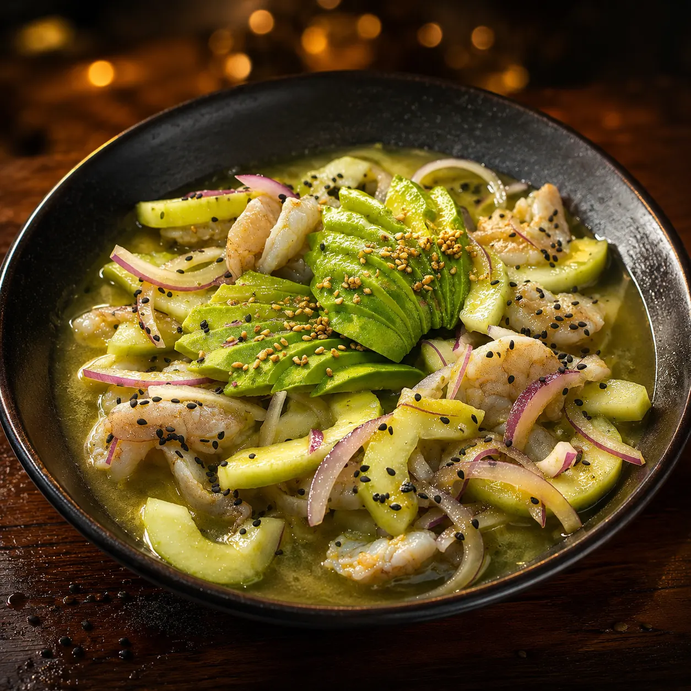
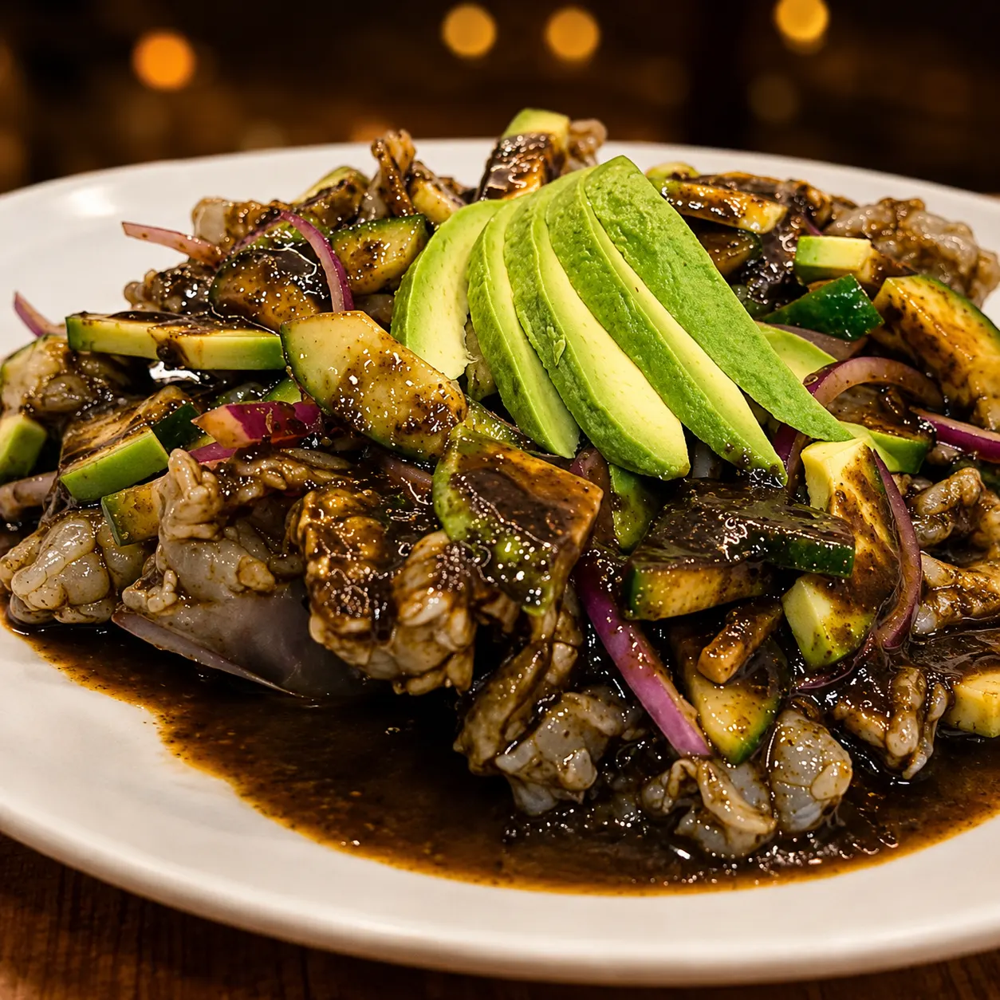
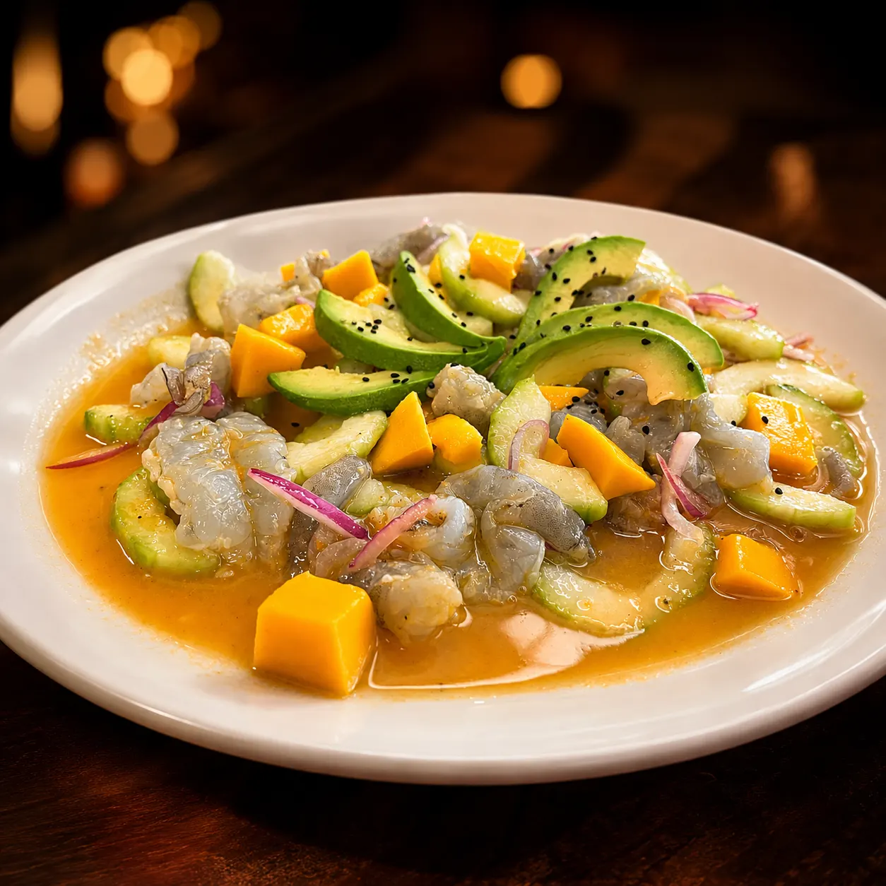

# Tipos de aguachile: verde, negro y mango | Muelle 27

> Guía de los 3 tipos de aguachile —verde, negro y mango—: qué lleva cada uno, cuál pica más y en qué se diferencian del ceviche, con la receta de la costa de Michoacán.

URL: https://mariscosmuelle27.com/blog/tipos-de-aguachile/

Saltar al contenido principal

Bitácora del muelle · Guía

# Tipos de aguachile: verde, negro y mango

Qué lleva cada aguachile, cuál pica más y en qué se diferencia del ceviche. Una guía honesta desde la cocina de una marisquería que los prepara con la receta de la costa de Michoacán, en Querétaro.

Por el equipo de **Mariscos Muelle 27** · Recetas de familia de la costa de Michoacán · Actualizado 15 de julio de 2026

**En resumen:** existen tres tipos principales de aguachile: **verde**, **negro** y de **mango**. El **verde es el más tradicional**, el **negro el más picoso** y el de **mango el más equilibrado** entre lo dulce y lo picante. Los tres se preparan con camarón fresco marinado al momento en limón. En los aguachiles de Mariscos Muelle 27 seguimos la receta de la costa de Michoacán, y el nivel de picante se ajusta a tu gusto: bajo, medio o alto.

## ¿Qué es el aguachile?

El aguachile es un platillo mexicano de camarón crudo marinado en jugo de limón, chile y sal, servido con cebolla y pepino. Su nombre significa literalmente "agua de chile" y su origen está en Sinaloa, donde primero se hacía con carne y chile chiltepín y después se cambió por camarón (Infobae).

La clave de un buen aguachile es la frescura del camarón, porque va crudo: el limón lo curte en cuestión de minutos y le da esa textura firme y jugosa. No se cocina con calor, se "cocina" con el ácido del cítrico. Por eso, más que una receta complicada, el aguachile es un platillo de producto: si el camarón no está fresco, no hay salsa que lo salve.

## ¿Cuántos tipos de aguachile hay?

Los tres tipos de aguachile más pedidos son el **verde**, el **negro** y el de **mango**. Se diferencian en la base de sabor —el chile y los ingredientes que los marinan— y en el nivel de picor. Esta tabla los compara de un vistazo antes de entrar en detalle:

TipoBase de saborNivel de picorIdeal para

**Verde**Chile serrano, cebolla morada, limón y pepinoModeradoQuien busca lo clásico y fresco

**Negro**Mezcla de salsas negras intensas, cebolla morada y pepinoAlto (el más picoso)Quien le sabe al picante serio

**Mango**Chile habanero, mango fresco, cebolla y pepinoDulce-picosito equilibradoQuien quiere el contraste dulce y picante

Aguachile verde

### El verde: el más tradicional

Camarón fresco, chile serrano, cebolla morada, limón y pepino. Picor moderado y frescor herbal. Es el clásico y el más pedido de la casa.

Aguachile negro

### El negro: el más picoso

Una mezcla de salsas negras de sabor intenso con cebolla morada y pepino. Ahumado y con carácter, para quien busca picor de verdad.

Aguachile de mango

### El mango: el equilibrado

Chile habanero, mango fresco, cebolla y pepino. La combinación de lo dulce con lo picosito lo volvió uno de los favoritos. Una explosión de sabor.

## ¿Cuál es el aguachile más picoso?

El **aguachile negro es el más picoso**. Su intensidad viene de la mezcla de salsas negras hechas con chiles secos, que aportan un picor profundo y ahumado. Le sigue el de mango —donde el chile habanero, que alcanza entre 100,000 y 350,000 unidades Scoville (unas diez veces más que el serrano del verde), se equilibra con la dulzura de la fruta— y por último el verde, de picor moderado. Si buscas la versión más intensa, lee nuestra guía dedicada al aguachile negro.

La buena noticia: el picante no tiene por qué asustarte. En Mariscos Muelle 27 **ajustamos el nivel a bajo, medio o alto** según tu gusto, así que puedes pedir el negro suavecito o el verde con más filo. Como nos lo dijeron en la cocina:

"Normalmente el más picoso es el negro, pero podemos ajustar el nivel de picor. La elección depende del gusto de cada quien: el verde el más tradicional, el de mango una explosión de sabor dulce y picosito, y el negro delicioso con esa combinación de salsas negras."

## ¿En qué se diferencia el aguachile del ceviche?

La diferencia principal es el tiempo de marinado y el picante. El aguachile se marina **solo unos minutos** y se sirve de inmediato, lo que mantiene el camarón firme y jugoso; el ceviche, en cambio, reposa entre **20 y 30 minutos** en jugo de limón hasta "cocinarse" del todo (El Universal). El aguachile también suele ser más picante y es un platillo mexicano, mientras que el ceviche pertenece a la tradición de toda la costa latinoamericana (Directo al Paladar).

Dicho simple: el aguachile es picante e inmediato; el ceviche es cítrico y reposado. Si prefieres el segundo, en nuestra carta de ceviches y tostadas encuentras el ceviche de pescado por jarra y nueve tostadas para compartir.

## ¿Cómo se come el aguachile?

El aguachile se come con **tostadas y una cerveza bien fría**, y sabe mejor entre las **12:00 y las 18:00**, cuando el calor pide algo fresco. Se sirve por jarra para compartir, se pone al centro de la mesa y cada quien arma su tostada. El truco es no dejarlo reposar demasiado: entre más pronto lo comas después de servido, más firme está el camarón.

En el muelle lo acompañamos con una michelada o una cerveza de nuestra carta de bebidas; el contraste del frío con el picante es justo lo que lo hace adictivo en un día de calor en Querétaro.

## El aguachile de la costa de Michoacán

El aguachile nació en Sinaloa, pero cada costa del Pacífico mexicano lo hace suyo. El nuestro viene de la **cocina de la costa de Michoacán**: recetas familiares que han pasado de generación en generación y que durante años solo se cocinaban en casa, entre la familia, con lo recién sacado del mar. Ese es el sabor que hoy servimos en la mesa.

"Buscamos conservar el sabor auténtico de la costa, de nuestras raíces, de quien nos enseñó estas recetas tradicionales y que cocinaban lo recién sacado del mar. Seguimos tal cual esas recetas."

Frente al aguachile sinaloense —más seco y con el chile al frente—, la versión michoacana que preparamos prioriza el **balance cítrico y el respeto por el camarón**. Puedes conocer más de esa historia en la página de la familia detrás del muelle.

## ¿Dónde comer aguachile en Querétaro?

Puedes comer aguachile verde, negro y de mango en **Mariscos Muelle 27**, en Jardín de Alcatraz s/n, **Jardines del Cimatario**, al sur de Querétaro. Servimos los cuatro aguachiles de la casa —incluido el *aguachile del muelle*, con camarón cocido, crudo y pulpo— por jarra de medio litro (para 2-3 personas) o un litro (para 4-5), en la terraza más fresca del sur de la ciudad.

Revisa precios y variedades completas en la carta de aguachiles, o mira toda la marisquería en Querétaro para armar tu mesa. Estamos abiertos de lunes a domingo, de 9:00 a 18:30.

Preguntas frecuentes

## Dudas rápidas sobre el aguachile

¿Cuántos tipos de aguachile hay?

Los tres tipos más comunes son el verde, el negro y el de mango. El verde es el más tradicional, el negro el más picoso y el de mango el más equilibrado entre lo dulce y lo picante. Los tres se preparan con camarón fresco marinado en limón.
¿Cuál es el aguachile más picoso?

El aguachile negro, por su mezcla de salsas negras de sabor intenso. En Mariscos Muelle 27 el nivel de picante se ajusta a bajo, medio o alto según tu gusto.
¿Qué lleva el aguachile verde?

Camarón fresco, chile serrano, cebolla morada, limón fresco y pepino. Es el más tradicional y de picor moderado.
¿En qué se diferencia el aguachile del ceviche?

El aguachile se marina solo unos minutos y suele ser más picante; el ceviche reposa entre 20 y 30 minutos en jugo de limón. El aguachile es mexicano; el ceviche es de tradición latinoamericana.
¿El aguachile se prepara con camarón crudo?

Sí. El camarón va crudo y se marina al momento en limón, que lo curte y le da su textura firme. Por eso la frescura del camarón es lo más importante.
¿A qué hora se recomienda comer aguachile?

Entre las 12:00 y las 18:00, cuando se antoja algo fresco. Se disfruta con tostadas y una cerveza bien fría, servido por jarra para compartir.

Sigue navegando

## De la guía a la mesa

I

### Carta de aguachiles

Los cuatro aguachiles de la casa, con precios y tamaños.
Ver capítulo →II

### Ceviches y Tostadas

Ceviche por jarra y nueve tostadas para compartir.
Ver capítulo →VII

### Bebidas

Micheladas, cervezas y aguas para acompañar.
Ver capítulo →

Ven al muelle

## Ven por tu aguachile hoy

Aguachile fresco al momento, camarón del Pacífico y sazón de la costa de Michoacán. La terraza más fresca del sur de Querétaro te espera.

💬 Reservar por WhatsApp📞 Llamar 442 808 5907
