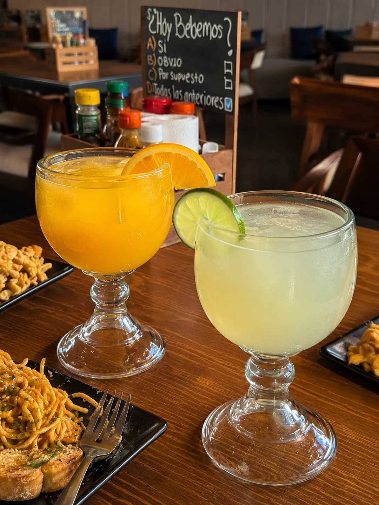
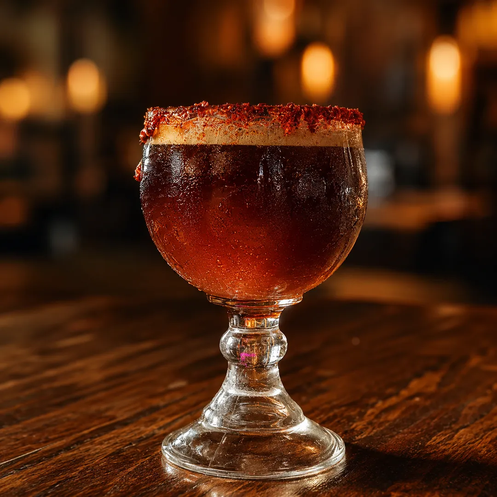

# Bebidas en Querétaro | Limonadas, Refrescos y Aguas | Mariscos Muelle 27

> Limonadas y naranjadas en jarra, micheladas, refrescos, agua mineral, Boing y aguas de sabor en Mariscos Muelle 27. Bebidas frescas en Jardines del Cimatario.

URL: https://mariscosmuelle27.com/carta/bebidas/

Saltar al contenido principal

Capítulo VII

# Bebidas en Querétaro

Limonadas y naranjadas recién exprimidas, micheladas de la casa, refrescos, agua mineral, Boing y aguas de sabor del día. El acompañamiento perfecto para una mariscada en la terraza más fresca del sur de Querétaro.

Reservar mesaLlamar 442 808 5907

Estrellas de este capítulo

## Las dos bebidas insignia

Limonada y naranjada recién exprimidas y michelada de la casa. Las dos que mejor acompañan una buena mariscada del muelle.

★ Estrella 01

### Limonada y naranjada

Recién exprimidas, con hielo abundante y cítricos de temporada. Perfectas para compartir en la mesa.
$65

★ Estrella 02

### Michelada de la casa

Tarro escarchado, cerveza bien fría y la salsa preparada del muelle. Acompañante clásico de las botanas marinas.
Consulta precio

Carta completa

## Todas las bebidas

Las opciones de la jarra, el refrigerador y la barra fría. Pregunta también por los sabores del día.

Preguntas al capitán

## Preguntas frecuentes

¿Las limonadas y naranjadas son recién exprimidas?

Sí, ambas se preparan en el momento. Llegan a la mesa con hielo abundante y rodajas frescas.
¿Tienen micheladas?

Sí, micheladas preparadas con la salsa de la casa. Pregunta a tu mesero por la disponibilidad y los tarros del día.
¿Hay agua de sabor todos los días?

Sí, rotamos los sabores cada día según la fruta de temporada. Pregunta a tu mesero cuál tenemos hoy.
¿Se puede pedir limonada o naranjada para llevar?

Sí, las preparamos en envase para llevar. Haz tu pedido por WhatsApp al 442 808 5907 y te confirmamos cuándo está lista.

Sigue navegando

## Otros capítulos

Nuestras bebidas acompañan toda la carta de Mariscos Muelle 27, marisquería en Querétaro. Explora los platillos:

I

### Aguachiles

Verde, negro, mango y del muelle.
Ver capítulo →III

### Camarones

Once preparaciones distintas.
Ver capítulo →VI

### Desayunos

Desde las 9 AM, Lun-Dom.
Ver capítulo →

Ven al muelle

## Reserva tu mesa hoy

Una limonada o naranjada en jarra bien fría y la mesa lista para los mariscos. Te esperamos.

💬 Reservar por WhatsApp📞 Llamar 442 808 5907
