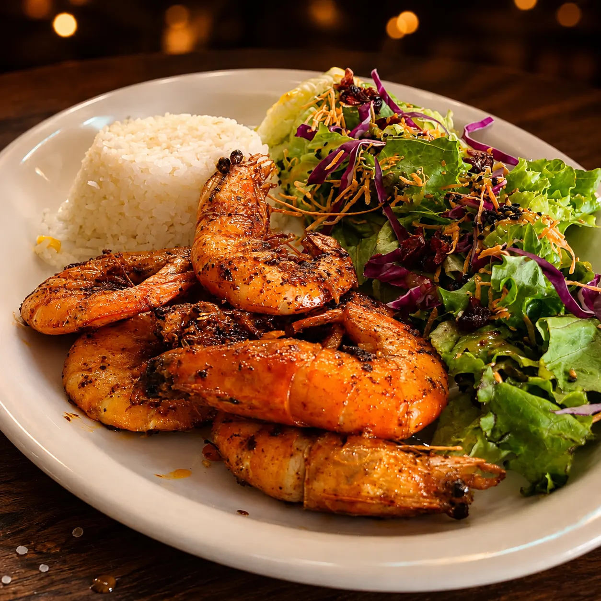
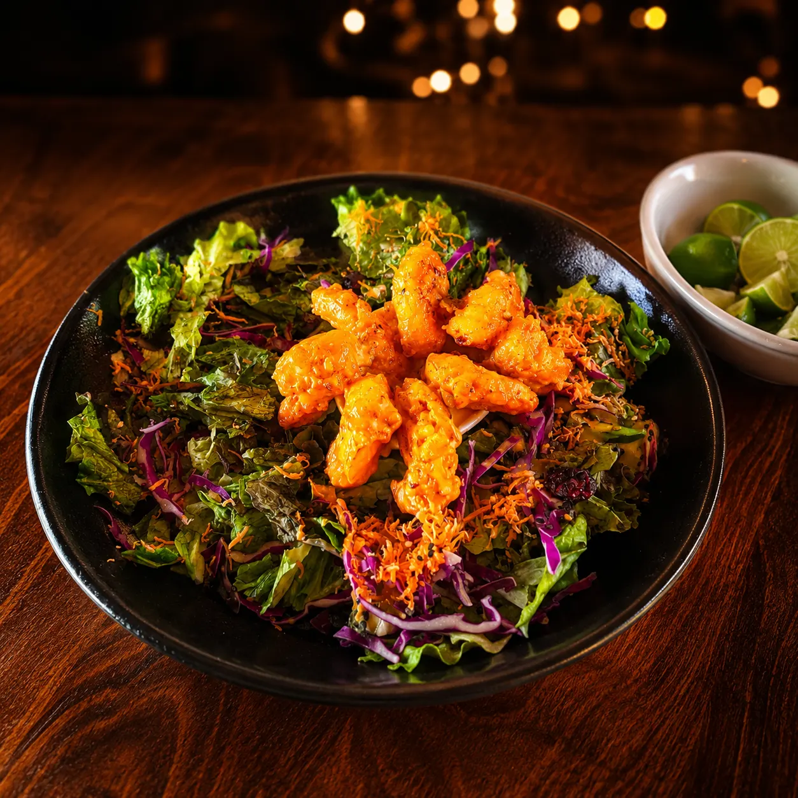
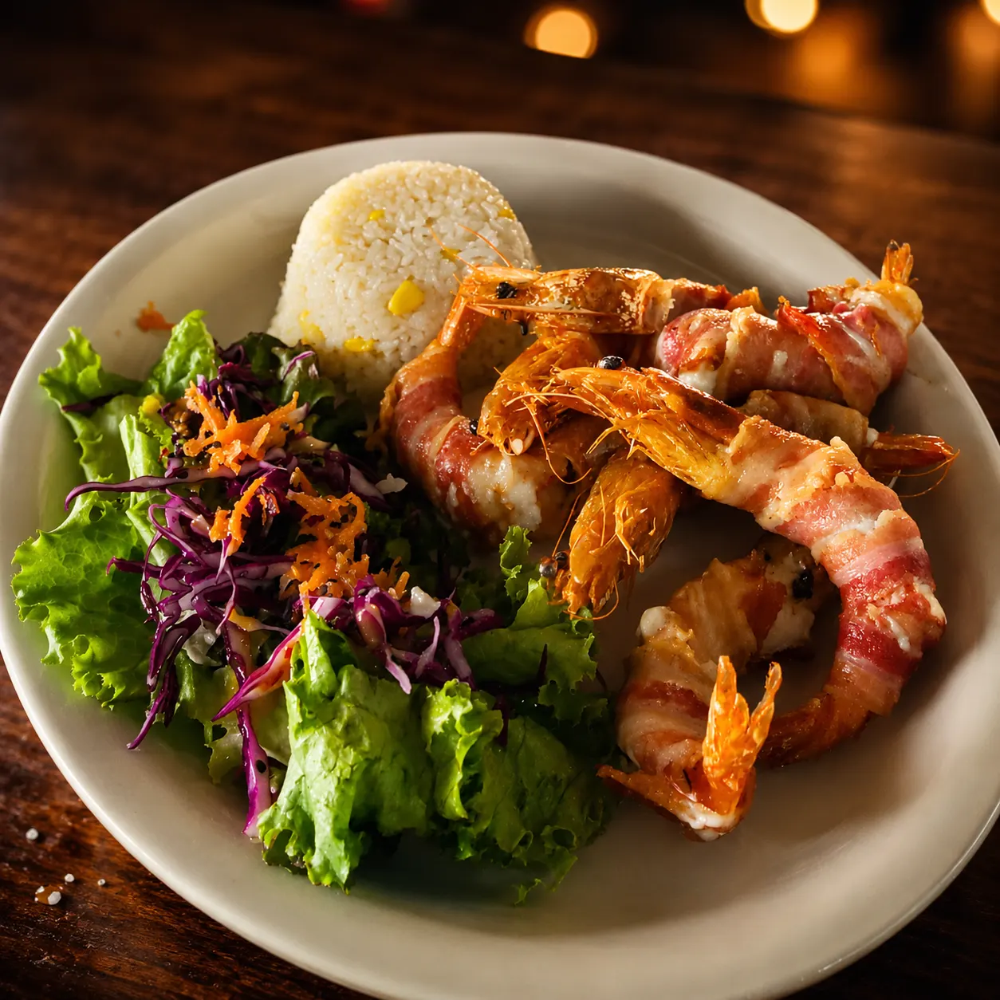
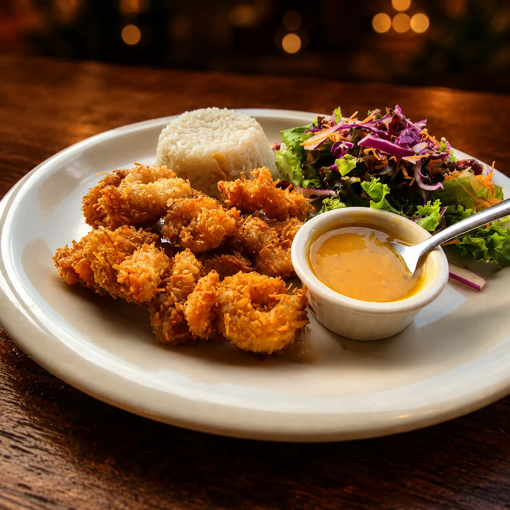

# Camarones en Querétaro | 11 Preparaciones | Mariscos Muelle 27

> Camarones a la diabla, empanizados, al coco, zarandeados, momia, roca y más en Querétaro. 11 preparaciones, todos $220 con arroz y ensalada.

URL: https://mariscosmuelle27.com/carta/camarones/

Saltar al contenido principal

Capítulo III

# Camarones en Querétaro

Once preparaciones distintas, todas a $220 con arroz y ensalada de la casa. Camarón fresco del Pacífico, sazón de Michoacán, recetas de generación en generación. El tripulante más querido del muelle.

Reservar mesaLlamar 442 808 5907

Estrellas de este capítulo

## Lo más pedido en camarones

Cuatro preparaciones que definen al muelle. Si vienes por primera vez, empieza por aquí.

★ Estrella 01

### Camarones Mario

Receta original de la casa: camarones salteados en mantequilla con un toque de salsa diabla. Pregunta a tu mesero por el secreto.
$220

★ Estrella 02

### Camarones roca

Camarón tempurizado bañado en salsa spicy. Crujiente por fuera, suave por dentro y con picor balanceado.
$220

★ Estrella 03

### Camarones momia

Rellenos de queso philadelphia y envueltos en tocino crujiente. La textura más fotogénica de la casa.
$220

★ Estrella 04

### Camarones al coco

Empanizados con coco rallado, acompañados de salsa de mango agridulce. Dulce-salado, favorito de quien viene por primera vez.
$220

Once formas de pedirlo

## Clásicos de la casa

Todas las preparaciones $220 con arroz y ensalada de la casa.

Recetas propias

## De la casa

Para abrir el apetito

## Cocteles de camarón

Tres tamaños y dos opciones (puro camarón, puro pulpo o mixto). El salvavidas es el más completo de la casa.

También en porción individual

## Camarones para botanear

Preguntas al capitán

## Preguntas frecuentes

¿Cuál es el más picoso?

A la diabla es el más picoso — lleva salsa de chile de árbol y ajo. Roca tiene salsa spicy intermedia. Cucaracha es picosito pero con un fondo agridulce que balancea.
¿La momia y la cucaracha qué llevan?

**Momia**: camarones rellenos de queso philadelphia envueltos en tocino y horneados — favorito de quien busca algo distinto. **Cucaracha**: camarones fritos salteados en nuestra salsa agridulce de la casa, con un equilibrio entre picor y dulzor.
¿Qué incluye el coctel salvavidas?

Camarón, pulpo, callo de hacha y ostión en la misma copa. Es el coctel más completo de la casa, $200.
¿Puedo pedir media orden?

No manejamos medias órdenes en camarones. Pero puedes pedir tostadas o tacos como porción individual desde $90.

Sigue navegando

## Otros capítulos

Nuestros camarones son parte de la carta completa de Mariscos Muelle 27 en Querétaro. Descubre más capítulos:

I

### Aguachiles

Verde, negro, mango y del muelle.
Ver capítulo →II

### Ceviches y Tostadas

Nueve tostadas individuales y ceviche por jarra.
Ver capítulo →IV

### Pescados y Mojarras

Filete, mojarra entera y pulpo.
Ver capítulo →

Ven al muelle

## Reserva tu mesa hoy

Once formas de comer camarón, ningún día igual. Pide la momia si nunca la has probado.

💬 Reservar por WhatsApp📞 Llamar 442 808 5907
