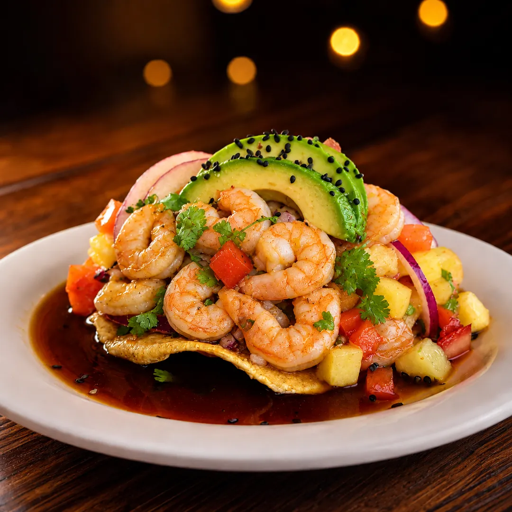
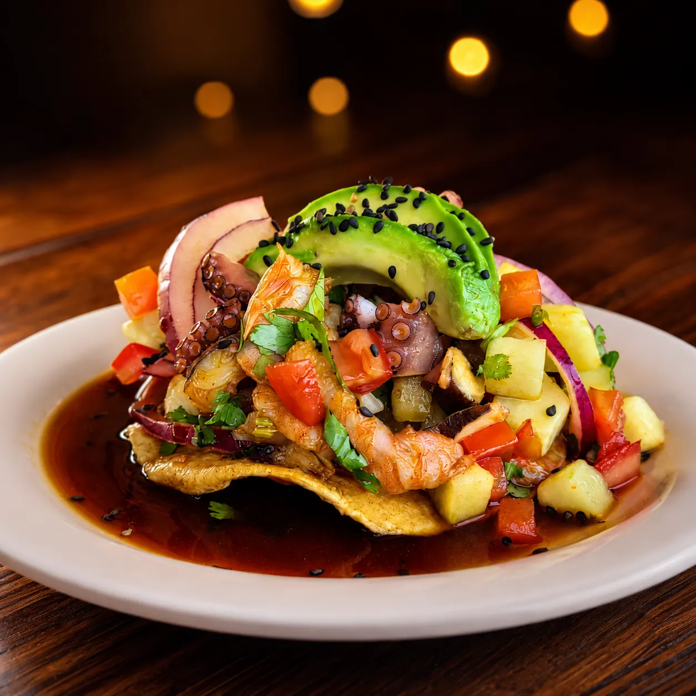
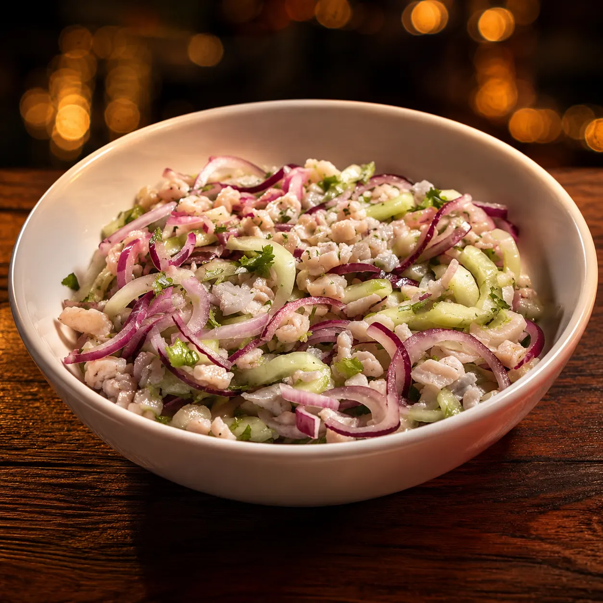
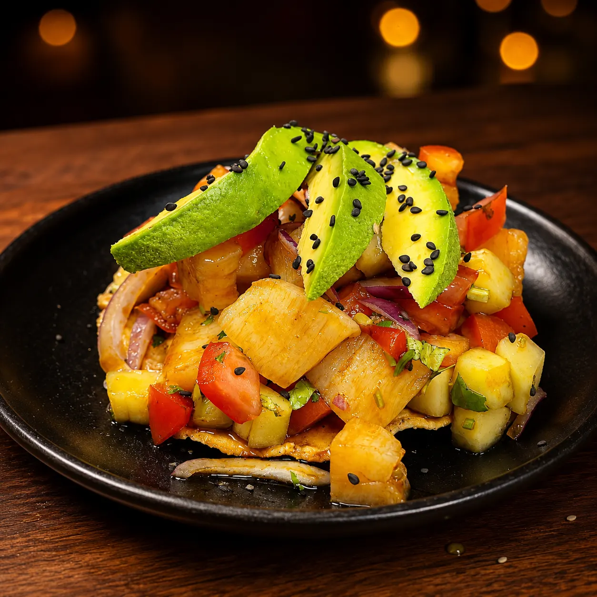

# Ceviches y Tostadas en Querétaro | Mariscos Muelle 27

> Tostadas de camarón, pulpo, atún, callo de hacha y ceviche en Querétaro. Receta de la costa de Michoacán, heredada de generación en generación.

URL: https://mariscosmuelle27.com/carta/ceviches-y-tostadas/

Saltar al contenido principal

Capítulo II

# Ceviches y Tostadas en Querétaro

Nueve tostadas individuales y ceviche por jarra de medio litro o un litro. Producto fresco marinado en limón, con la receta de la costa de Michoacán heredada de generación en generación. Acompañados de aguacate, cebolla, cilantro y chile al gusto.

Reservar mesaLlamar 442 808 5907

Estrellas de este capítulo

## Lo más pedido en ceviches y tostadas

Cuatro entradas que abren el apetito y son favoritas del muelle. Empezar por aquí nunca falla.

★ Estrella 01

### Tostada de camarón

Camarón fresco con jitomate, pepino, cilantro, chile serrano, mango y aguacate. La favorita para botanear.
$95

★ Estrella 02

### Tostada de camarón y pulpo

La combinación perfecta del mar: camarón y pulpo en la misma tostada con todos los frescos.
$95

★ Estrella 03

### Ceviche

Camarón, pescado o mixto en jarra de medio litro o un litro. Receta tradicional de la costa de Michoacán para compartir.
desde $180

★ Estrella 04

### Tostada de callo de hacha

Callo fresco con aderezo spicy y salsa de la casa. La premium del capítulo para los que conocen el mar.
$100

Por pieza

## Tostadas individuales

Pídelas sueltas. Cada tostada es una pieza completa, perfecta para botanear o como entrada antes del platillo principal.

Por jarra para compartir

## Ceviche

Disponible en camarón, pescado o mixto. Acompañado de pepino, cebolla morada, cilantro, aguacate y chile serrano.

Recetas que viajaron

## La costa de Michoacán en tu mesa

La costa michoacana tiene sazón propio: respeto por el pescado blanco, frescor cítrico, equilibrio de chile sin dominar el sabor del mar. Esa es la receta que nuestra familia trajo a Querétaro y que cada cocinero de la casa sigue al pie de la letra.

El camarón se marina al momento — nunca antes — para que el limón abrace al producto sin cocerlo de más.

Preguntas al capitán

## Preguntas frecuentes

¿Cuál es la tostada más pedida?

La de camarón ($90), por ser la más completa con mango, aguacate y salsa de la casa.
¿Qué diferencia un ceviche michoacano de uno sinaloense?

La costa de Michoacán prioriza el pescado blanco y el balance cítrico. El sinaloense tiende a ser más picante y con camarón seco. El nuestro respeta la frescura del producto.
¿Puedo pedir media tostada?

Cada tostada es una pieza. Se piden por pieza, así que ordena las que se te antojen.
¿Cuántas tostadas alcanzan a una persona?

2-3 tostadas como entrada, 4 como plato principal ligero. La de camarón llena más por el mango y aguacate; la de pata de marlín es más liviana.

Sigue navegando

## Otros capítulos

Los ceviches y tostadas son parte de la marisquería del sur de Querétaro anclada en Jardines del Cimatario. Sigue navegando la carta:

I

### Aguachiles

Verde, negro, mango y del muelle. Por jarra.
Ver capítulo →III

### Camarones

Once preparaciones distintas, $220 c/u.
Ver capítulo →IV

### Pescados y Mojarras

Filete, mojarra entera y pulpo.
Ver capítulo →

Ven al muelle

## Reserva tu mesa hoy

Tostadas frescas, ceviche al momento, sazón de Michoacán. Te esperamos en Jardín de Alcatraz s/n.

💬 Reservar por WhatsApp📞 Llamar 442 808 5907
