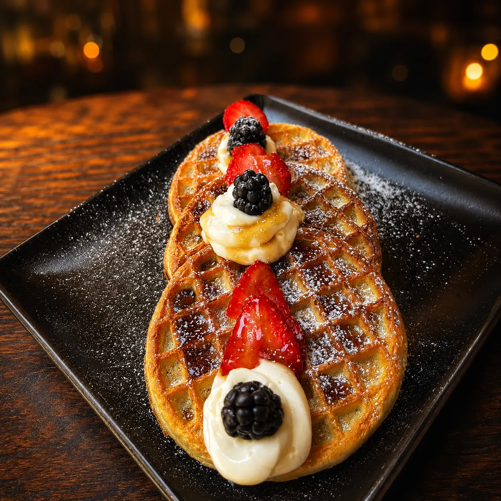
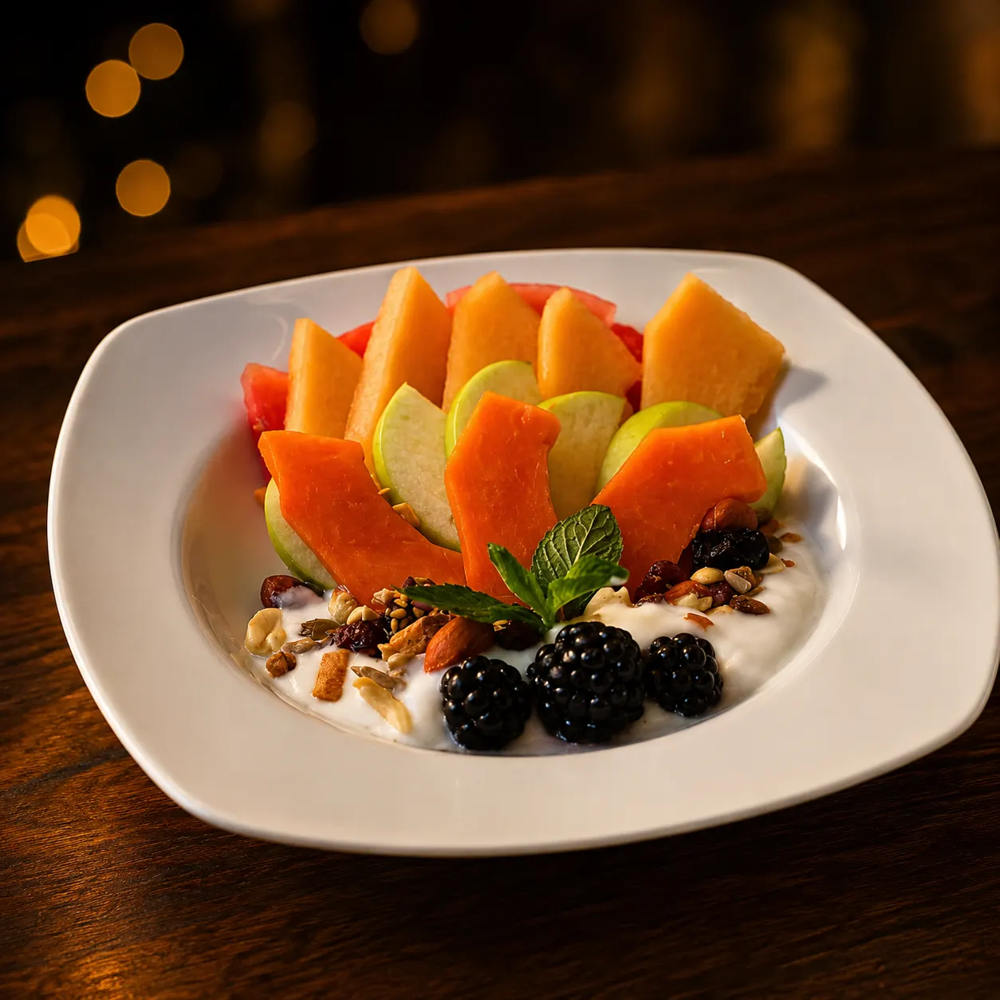
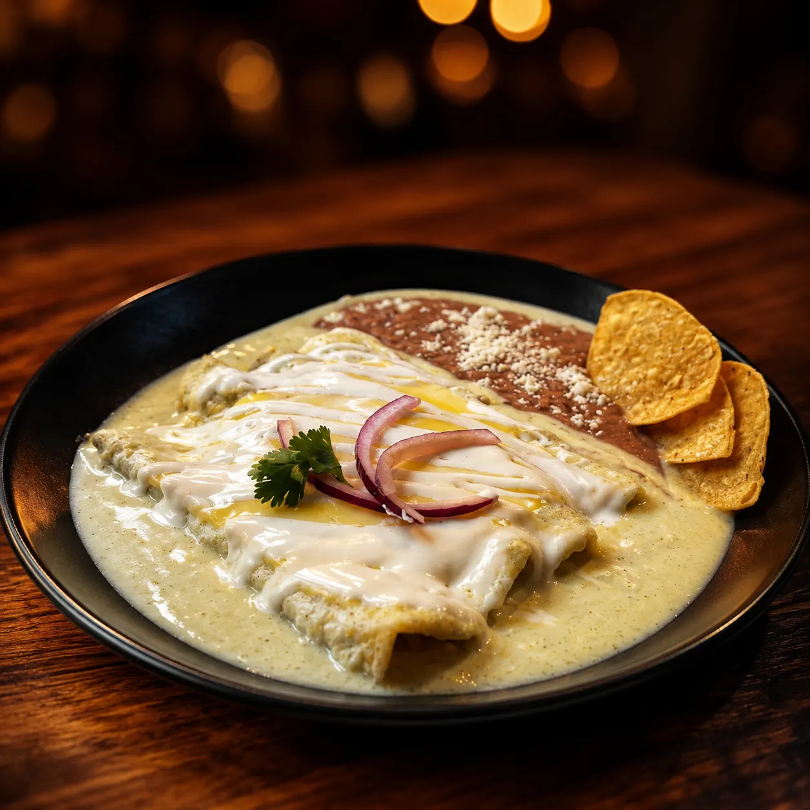
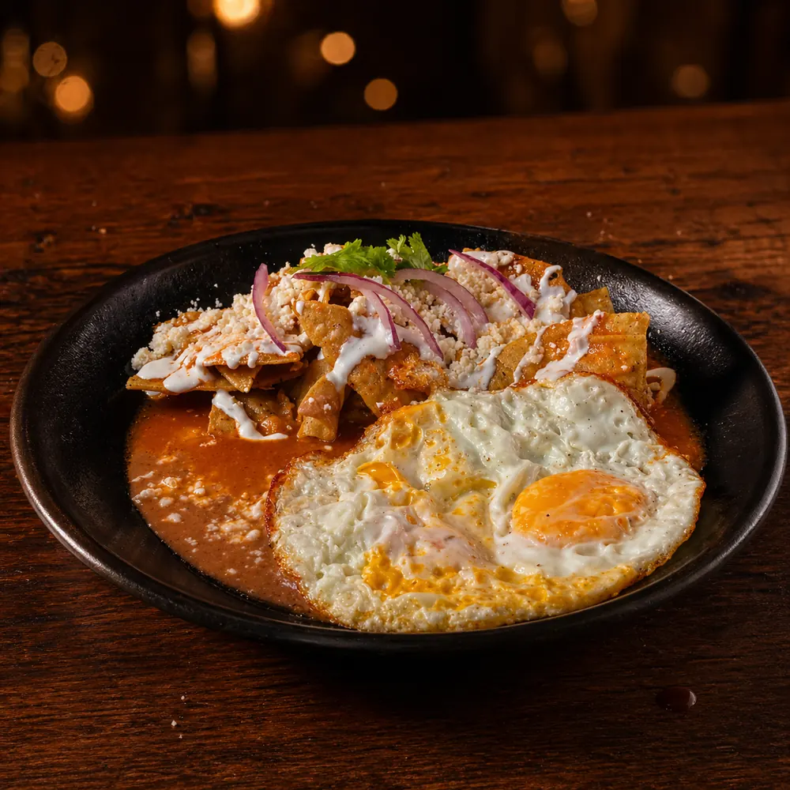

# Desayunos en Jardines del Cimatario | Mariscos Muelle 27

> Desayunos desde las 9 AM en Mariscos Muelle 27, Jardines del Cimatario. Huevos al gusto, chilaquiles, omelettes, hot cakes y café de olla. Lun-Dom.

URL: https://mariscosmuelle27.com/carta/desayunos/

Saltar al contenido principal

Capítulo VI · Desde 9 AM

# Desayunos en Jardines del Cimatario

Desde las 9:00 de la mañana, de lunes a domingo. Huevos al gusto, chilaquiles, omelettes, enchiladas, molletes, hot cakes, wafles y café de olla. **Todos los desayunos incluyen jugo o fruta y café sin refil.**

Reservar mesaLlamar 442 808 5907

Estrellas de este capítulo

## Los más pedidos del desayuno

Cuatro favoritos que abren la mañana en el muelle. Desde dulce hasta tradicional, hay para cada antojo.

★ Estrella 01

### Waffles

Crujientes por fuera, esponjosos por dentro. Con miel, fruta de temporada y crema. El dulce favorito de la mañana.
Consulta precio

★ Estrella 02

### Coctel de fruta

Mezcla generosa de frutas frescas de temporada con yogurt o granola. La opción ligera y refrescante para arrancar el día.
Consulta precio

★ Estrella 03

### Enchiladas suizas

Tortillas rellenas, bañadas en salsa verde y gratinadas con queso. Con crema, cebolla y frijoles. El tradicional bien servido.
Consulta precio

★ Estrella 04

### Chilaquiles rojos

Totopos bañados en salsa roja con crema, queso, cebolla y frijoles. Súmale huevo o proteína para hacerlo plato completo.
Consulta precio

Lo clásico

## Huevos al gusto

Incluye 2 huevos, frijoles y totopos.

Tres ingredientes a escoger

## Omelette

Verdes o rojos

## Chilaquiles

Acompañados de frijoles, queso, crema y cebolla.

Verdes o rojas

## Enchiladas

Acompañadas de frijoles, queso, crema y cebolla.

Para empezar el día

## Clásicos del desayuno

Lo dulce

## Hot cakes, wafles y postres

Fresco

## Fruta de temporada

Para acompañar

## Bebidas y extras

Por qué desayunar aquí

## Razones para arrancar el día en el muelle

🌅

### Desde 9 AM

Abrimos temprano, antes de que llegue el gentío de la comida. Mesa lista, café caliente.

🌿

### Terraza fresca

El sur de Querétaro despierta con aire suave; la terraza es el mejor lugar para empezarlo.

☕

### Café de olla

Acompañamiento tradicional, no café de cafetera. Y todos los desayunos incluyen jugo o fruta.

Preguntas al capitán

## Preguntas frecuentes

¿Hasta qué hora sirven desayunos?

Hasta mediodía aproximadamente. Después pasamos al menú de comida.
¿Hay opciones vegetarianas?

Sí. Huevos, chilaquiles sin pollo, molletes, omelette de queso/champiñón/espinaca, hot cakes, wafles y plato especial de frutas.
¿Los desayunos incluyen café con refil?

Café incluido sin refil. Si quieres más, lo pides aparte (café de olla $49, americano $50, capuchino $69).
¿Tienen menú infantil para desayuno?

Sí, pueden pedir hot cakes ($125), quesadillas (sección de la carta principal $50) o huevos sencillos ($110).

Sigue navegando

## Otros capítulos

Los desayunos son parte de la carta de nuestra marisquería en Jardines del Cimatario, Querétaro. Sigue explorando:

V

### Pozole · Jue-Vie

Tres tamaños desde $40, sólo jueves y viernes.
Ver capítulo →I

### Aguachiles

Verde, negro, mango y del muelle.
Ver capítulo →·

### Carta completa

Todo lo que servimos: entradas, ensaladas, especiales, mariscadas.
Ver carta completa →

Arranca el día en el muelle

## Reserva tu mesa de desayuno

Lun–Dom desde las 9 AM. Café de olla, terraza fresca, mesa puesta.

💬 Reservar por WhatsApp📞 Llamar 442 808 5907
