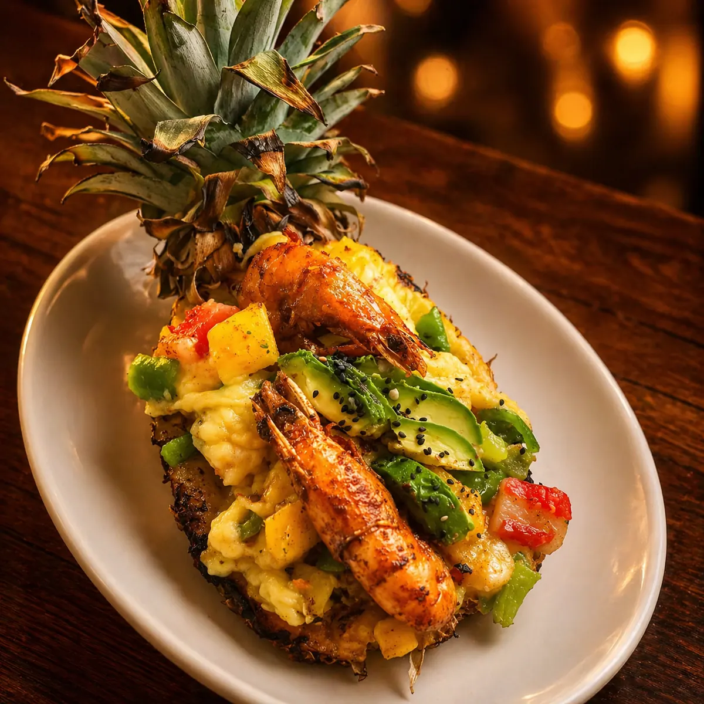
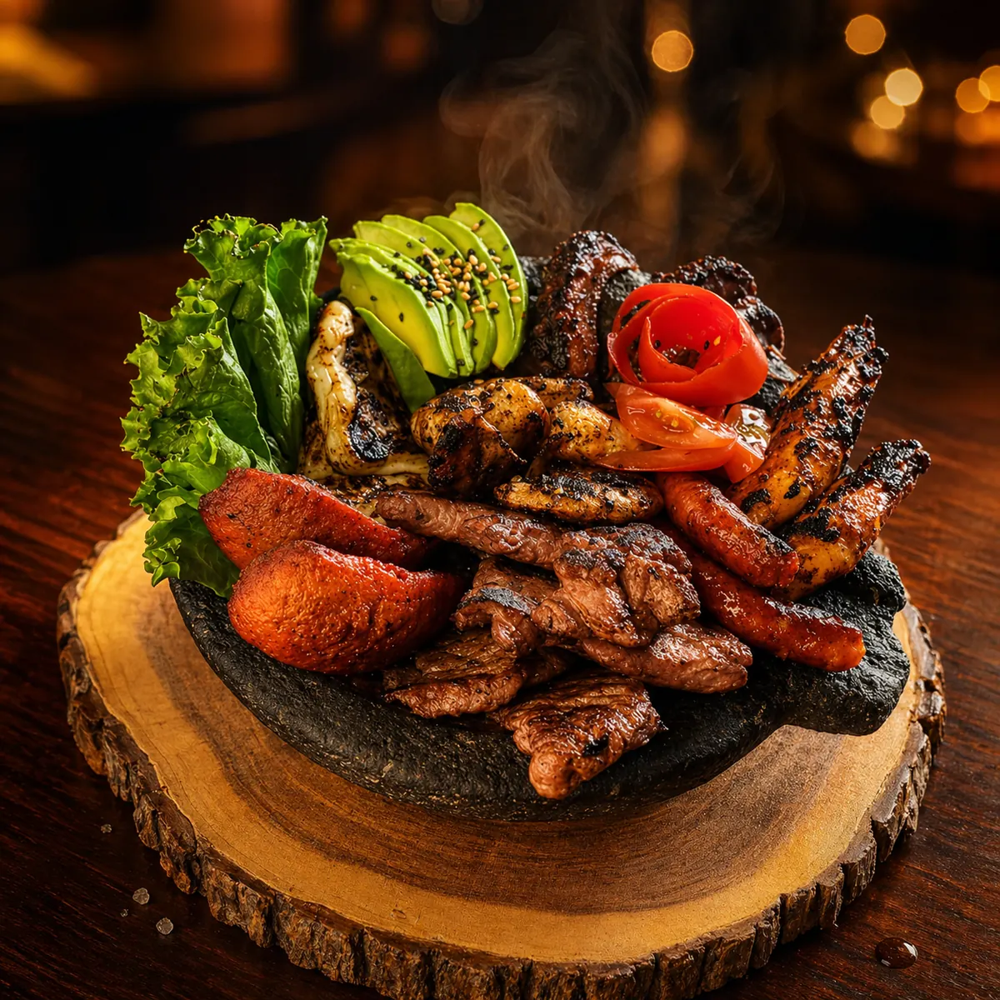
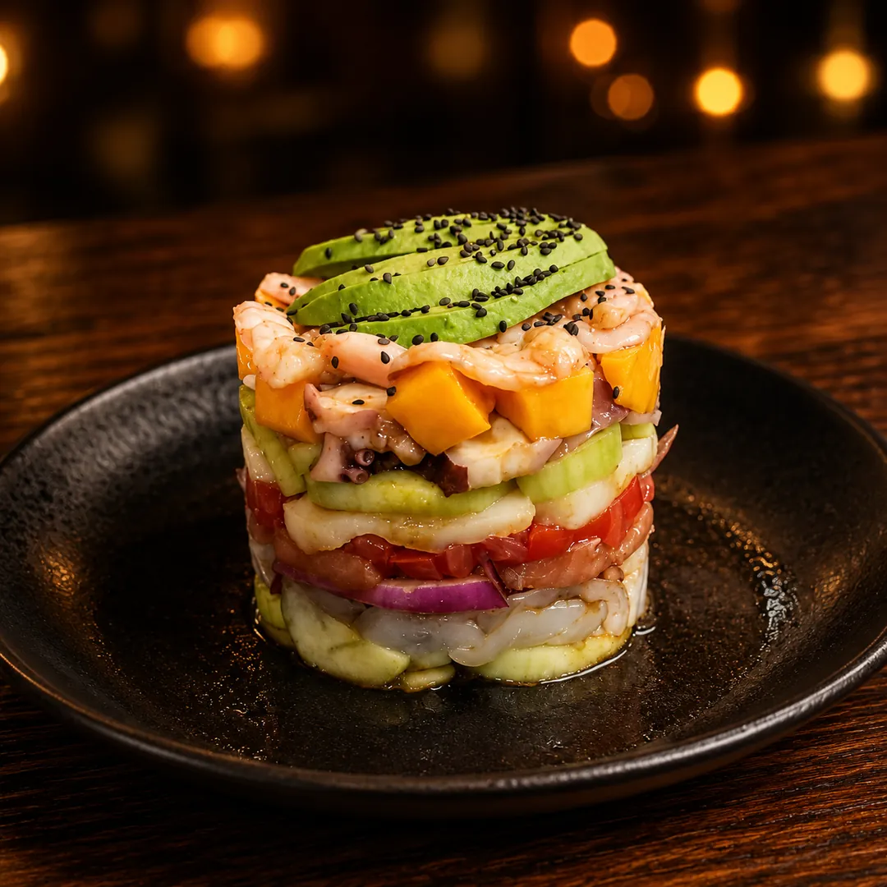
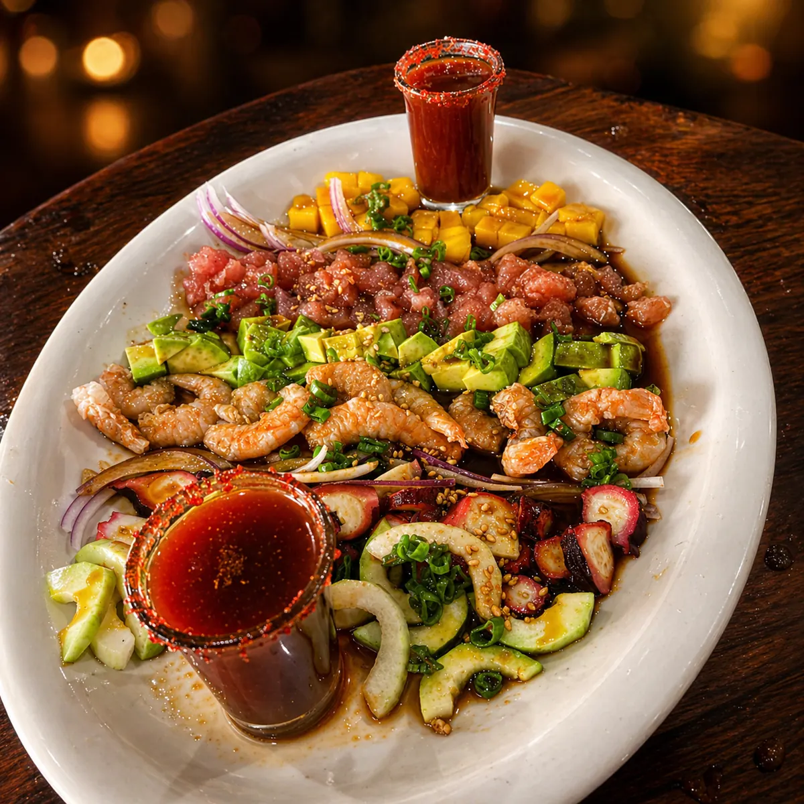
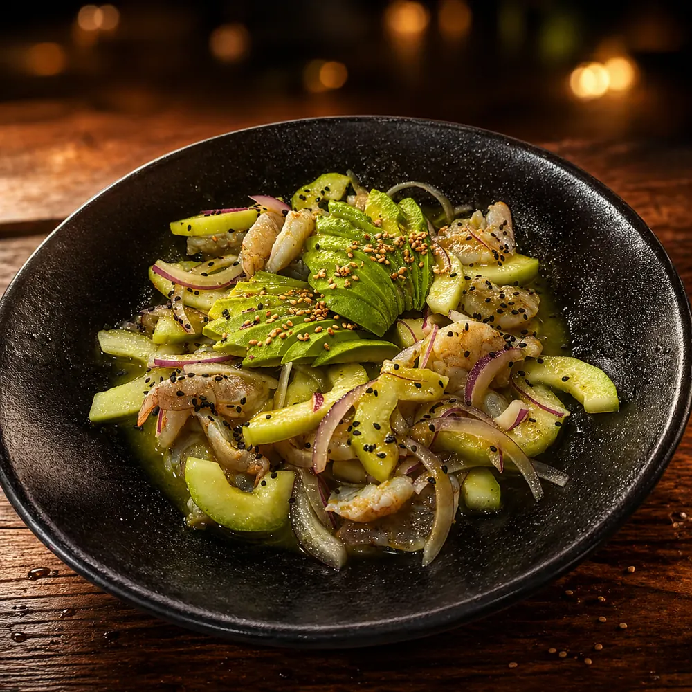
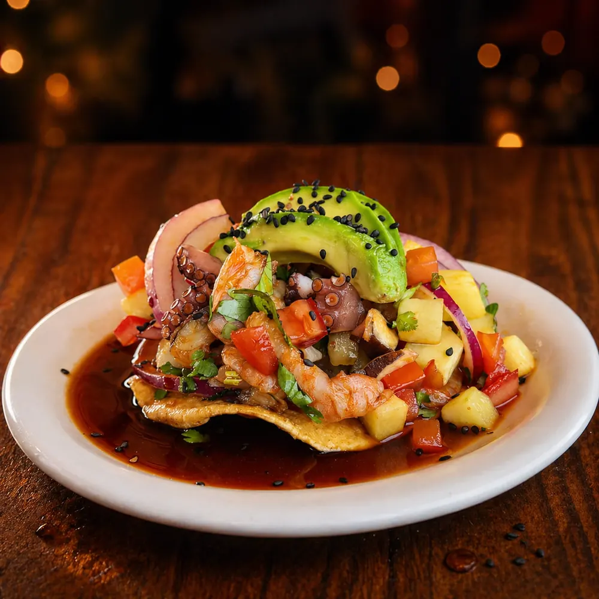
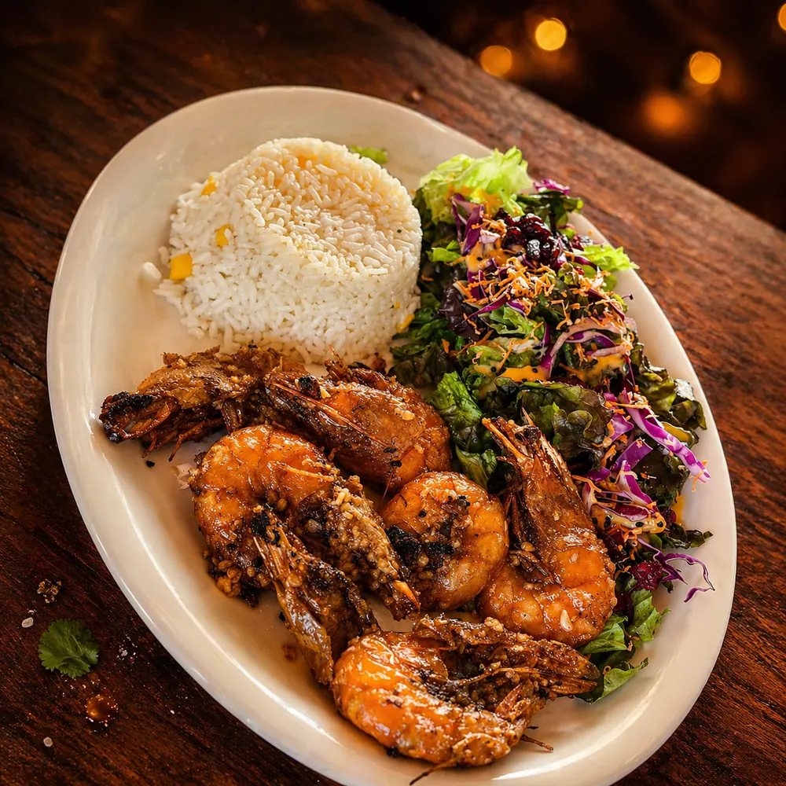
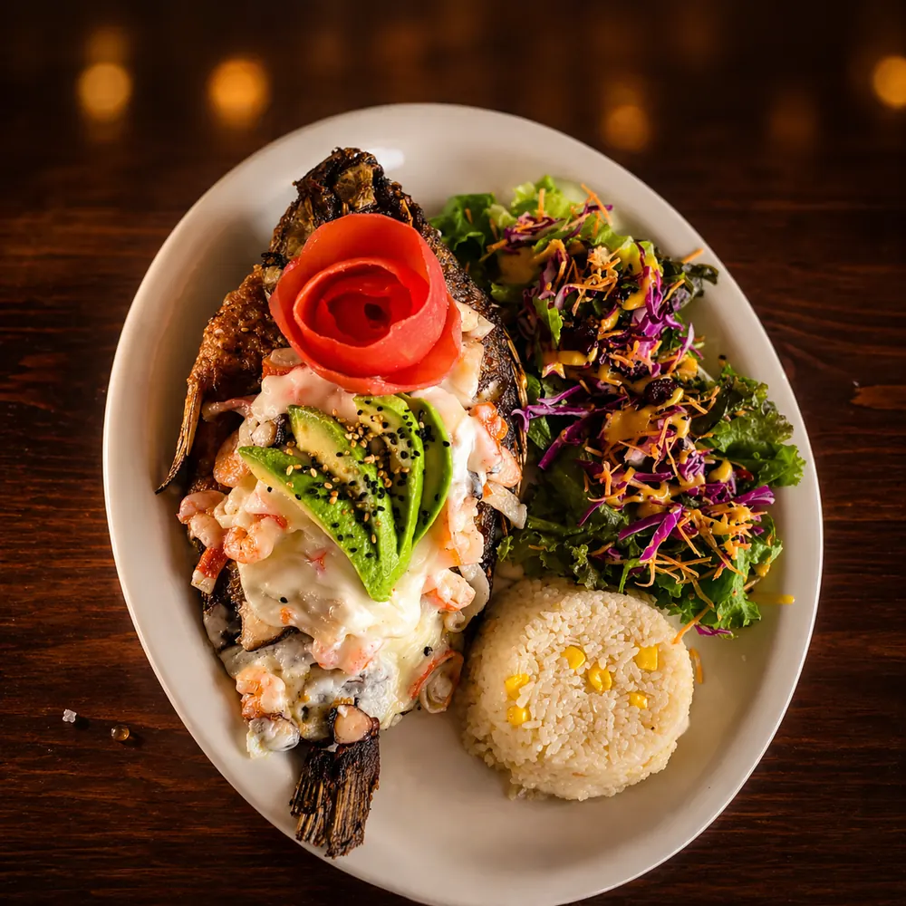
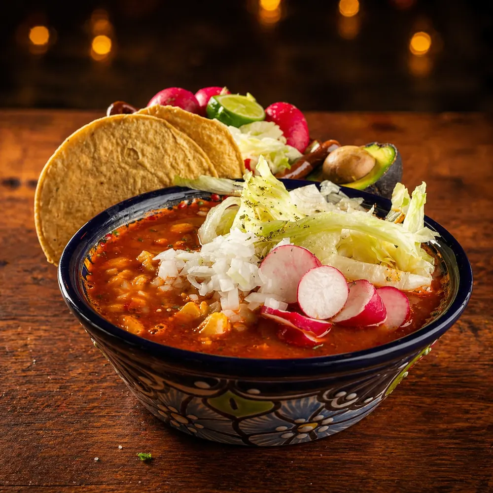
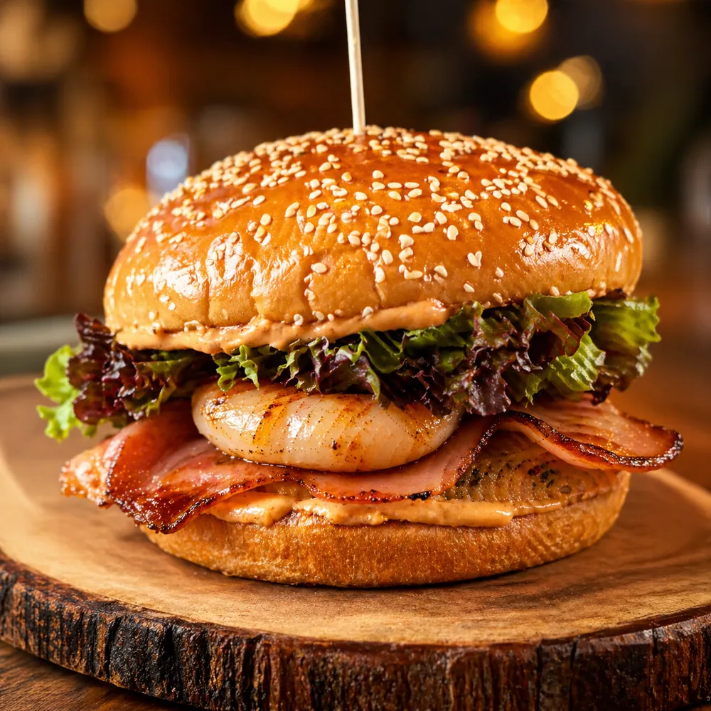

# Carta de Mariscos en Querétaro | Mariscos Muelle 27

> Carta completa de Mariscos Muelle 27: aguachiles, ceviches, tostadas, camarones, pescados, pozole jue-vie, desayunos, mariscadas y más. Precios visibles.

URL: https://mariscosmuelle27.com/carta/

Saltar al contenido principal

Cuaderno de Bitácora

# Carta de Mariscos Muelle 27

Seis capítulos principales, todos los precios visibles. Aguachiles, ceviches, camarones, pescados, pozole los jueves-viernes y desayunos desde las 9 AM. Mariscos frescos de la costa de Michoacán, recetas heredadas de generación en generación.

Reservar mesaLlamar 442 808 5907

★ Recomendados por el capitán

## La mesa del capitán

Cuatro platillos que no se reservan, se piden con tiempo. Especiales que valen el viaje al muelle, sin importar de qué capítulo te toque venir.

⚓ Recomendación 01

### Piña rellena

Mezcla de mariscos y pimientos servida en su propia cáscara, gratinada con queso. Tropical y completa.
$280

⚓ Recomendación 02

### Molcajete mar y tierra

Arrachera, chistorra, salchicha, pulpo, camarones y queso panela. El más completo de la casa, con tortillas calientitas.
$360

⚓ Recomendación 03

### Torre de mariscos

Capas de camarón crudo y cocido, pulpo, callo de hacha, aguacate, pepino y jitomate, marinada con salsas negras.
$250

⚓ Recomendación 04

### Mariscada fría

Atún, camarón crudo y cocido, pulpo, pepino, cebolla morada, mango y aguacate. Acompañada de shot de clamato y salsa de la casa.
$290

Cuaderno de Bitácora

## El mar entero en seis capítulos

I

### Aguachiles

Verde, negro, mango y del muelle. Por jarra de medio o un litro.
Ver capítulo →II

### Ceviches y Tostadas

Nueve tostadas individuales y ceviche por jarra. Costa de Michoacán.
Ver capítulo →III

### Camarones

Once preparaciones distintas, $220 c/u. Cocteles en tres tamaños.
Ver capítulo →IV

### Pescados, Mojarras y Pulpo

Filete desde $190, mojarra entera $290, pulpo $270. Caldos del mar.
Ver capítulo →V

### Pozole · Jue-Vie

Sólo jueves y viernes, tres tamaños desde $40.
Ver capítulo →VI

### Desayunos · Desde 9 AM

Huevos, chilaquiles, omelettes, hot cakes y café de olla.
Ver capítulo →

Para abrir el apetito

## Entradas

Lo verde

## Ensaladas

Producto de temporada

## Especiales de la casa

Pregunta por disponibilidad — algunos especiales dependen de la pesca y el inventario de la semana.

Para compartir

## Mariscadas

Platillo del Capitán

## La Hamburguesa Muelle

El único platillo que lleva el nombre de la casa. Disponible con res o camarón. Lechuga, jitomate, cebolla, queso amarillo, queso manchego, tocino, champiñones, piña asada y chiles toreados. Acompañada de papas a la francesa.

$180 MXN

Disponible con res o camarón.

Reservar mi mesa

Lo que falta

## Acompaña tu mesa

Ven al muelle

## Reserva tu mesa hoy

Carta completa, precios visibles, ambiente familiar. La Hamburguesa Muelle te espera.

💬 Reservar por WhatsApp📞 Llamar 442 808 5907
