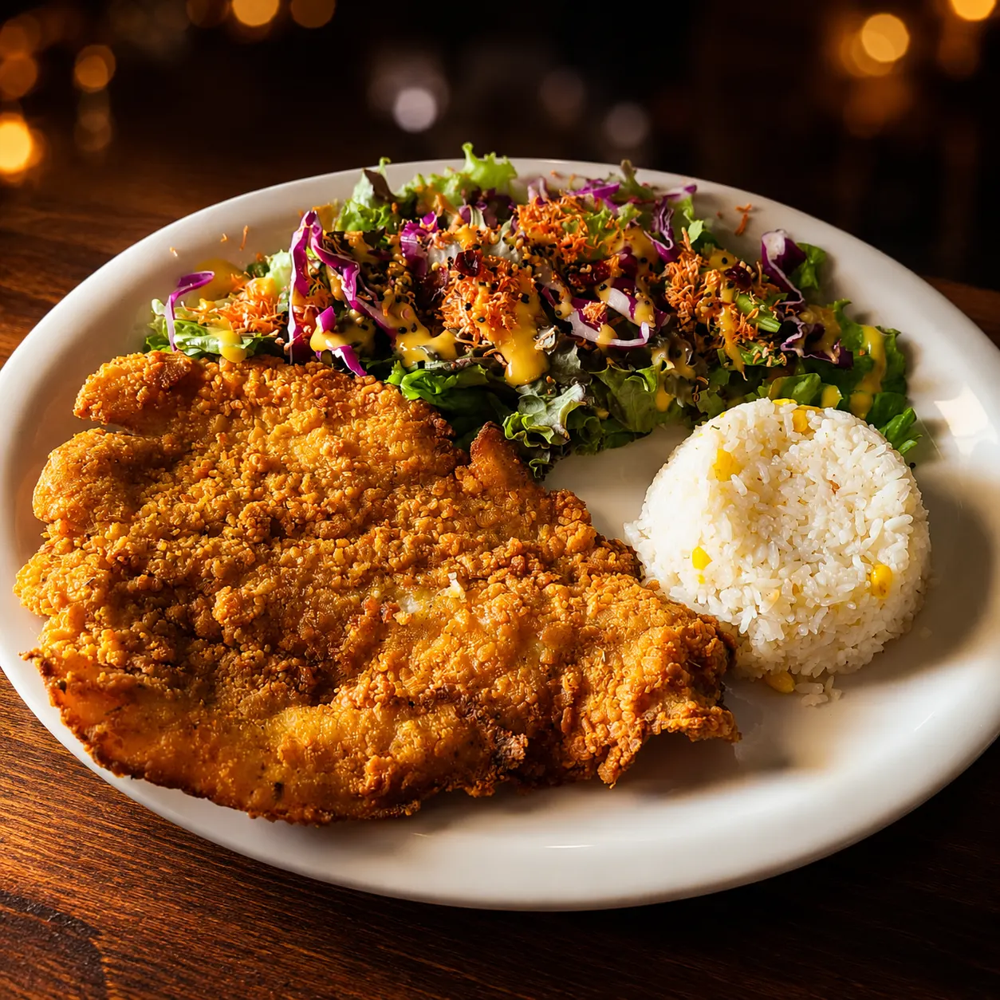
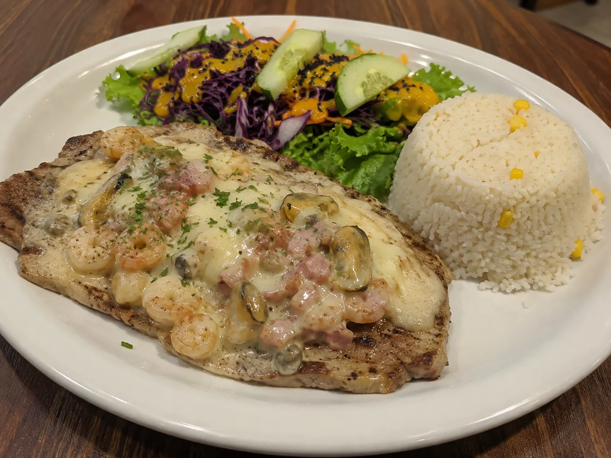
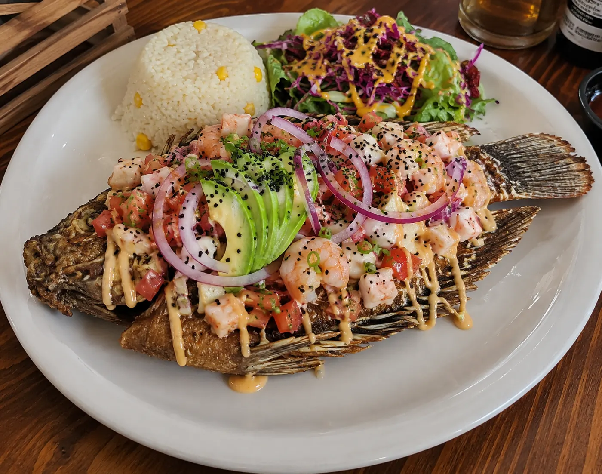
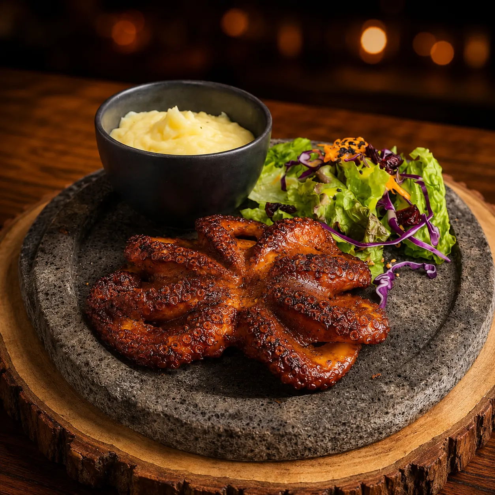

# Pescados, Mojarras y Pulpo en Querétaro | Mariscos Muelle 27

> Filete, pescado empapelado, mojarra entera y pulpo en Querétaro. Costa de Michoacán, sin conservadores, con arroz y ensalada. Jardines del Cimatario.

URL: https://mariscosmuelle27.com/carta/pescados-y-mojarras/

Saltar al contenido principal

Capítulo IV

# Pescados, Mojarras y Pulpo en Querétaro

Filete desde $190, mojarra entera desde $290 y pulpo en cuatro preparaciones a $270. Pesca del día, sin conservadores, recetas de la costa de Michoacán. Todo con arroz y ensalada de la casa. También caldos del mar para acompañar.

Reservar mesaLlamar 442 808 5907

Estrellas de este capítulo

## Lo más pedido en pescados, mojarras y pulpo

Cuatro platillos que definen al muelle. Si vienes a probar el mar entero, empieza por aquí.

★ Estrella 01

### Filete empanizado

Pescado blanco del Pacífico, capeado crujiente y dorado, limón aparte. El clásico para arrancar fácil.
$190

★ Estrella 02

### Filete especial Muelle

Preparado con mezcla de mariscos y gratinado con queso. La versión premium de la casa.
$220

★ Estrella 03

### Mojarra tuneada

Mojarra entera acompañada de una mezcla de mariscos y gratinada con queso. El platillo más fotogénico del muelle.
$320

★ Estrella 04

### Pulpo zarandeado

Pulpo a la parrilla con adobo del Pacífico. Humo, sazón de la costa y textura tierna. El más fotogénico del capítulo.
$270

Filete

## Filete de pescado

Pescado blanco del Pacífico, todas las preparaciones $190 con arroz y ensalada de la casa.

Pescado entero

## Mojarra

Mojarra entera, todas las preparaciones $290 con arroz y ensalada de la casa.

Cuatro preparaciones

## Pulpo

Todas a $270 con arroz y ensalada de la casa.

Para acompañar

## Caldos del mar

Preguntas al capitán

## Preguntas frecuentes

¿Qué tipo de pescado manejan?

Pescado blanco del Pacífico. La mojarra es entera (tilapia). El filete suele ser basa según disponibilidad de la pesca.
¿Cuál es la preparación más recomendada?

Para primera vez: el filete empapelado ($190) o la mojarra frita ($290). Para algo más completo: el especial Muelle ($220) o la tuneada ($320), ambos llevan mezcla de mariscos gratinada.
¿Se puede pedir sin picante?

Sí. La cocina separa las salsas o cambia por mojo de ajo / al ajillo, que no llevan chile picante.
¿Cómo viene servida la mojarra?

Entera, con arroz y ensalada de la casa al lado. Al gusto: frita, al mojo de ajo, a la diabla o al ajillo. La tuneada lleva mariscos y queso encima.

Sigue navegando

## Otros capítulos

Pescados, mojarras y pulpo forman parte de nuestra marisquería en Querétaro. Mira el resto de la carta:

I

### Aguachiles

Verde, negro, mango y del muelle.
Ver capítulo →III

### Camarones

Once preparaciones distintas, $220 c/u.
Ver capítulo →V

### Pozole · Jue-Vie

Tres tamaños desde $40, sólo jueves y viernes.
Ver capítulo →

Ven al muelle

## Reserva tu mesa hoy

Pesca del día, sin conservadores. Si vienes por primera vez, pide la tuneada.

💬 Reservar por WhatsApp📞 Llamar 442 808 5907
