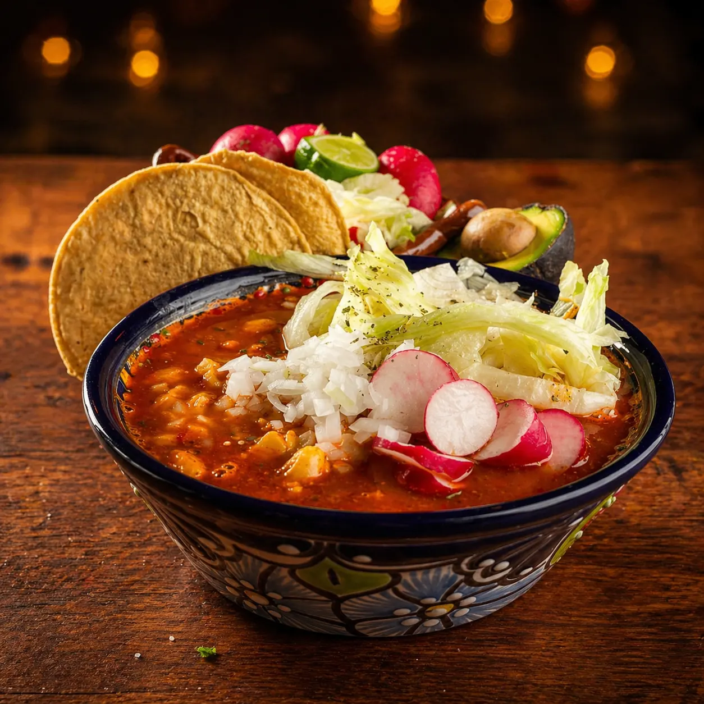

# Pozole de Camarón y Mariscos en Querétaro | Muelle 27

> Pozole de la casa sólo jueves y viernes en Mariscos Muelle 27, Cimatario. Tres tamaños desde $40. Llama al 442 808 5907 antes de que se acabe.

URL: https://mariscosmuelle27.com/carta/pozole/

Saltar al contenido principal

Capítulo V · Tradición semanal

# Pozole los Jueves y Viernes en Querétaro

Pozole estilo de la casa servido **sólo jueves y viernes**, durante el horario de comida 9:00 a 18:30 hrs. Tres tamaños: mini ($40), mediano ($80) y grande ($130). Humeante, con todos los recaudos al centro de la mesa. No se reserva, hasta agotar existencia.

Llamar antes del juevesApartar por WhatsApp

Días señalados

## Sólo jueves y viernes

Preparar pozole real toma tiempo y producto fresco. Preferimos ofrecerlo dos días bien hechos que siete días regulares. Si vienes un jueves y se acabó, es señal de que llegaste tarde — la próxima, madruga.

JuevesViernes

Pozole estilo de la casaCaldo rojo con grano de maíz cacahuazintle, camarón y trozos de marisco. Se sirve humeante, con tostadas, lechuga, rábano, orégano, cebolla, limón y chile al centro de la mesa.

Tres tamaños

## Tres porciones, tres maneras de pedirlo

Cómo lo servimos

## Pozole humeante, recaudos al centro

Cada plato llega caliente con su ración. Los recaudos llegan en charola al centro para que cada quien arme su pozole a gusto: cebolla, orégano, limón, rábano y tostadas aparte para los que no saben pararse en un solo plato.

No se reserva el pozole. Si llega tarde, ya no hay.

Preguntas al capitán

## Preguntas frecuentes

¿Es pozole rojo, verde o blanco?

Pregunta al llamar porque rotamos. Por lo general servimos pozole rojo; algunos viernes preparamos variante de mariscos.
¿Puedo llevar pozole para llevar?

Sí. Llama antes al 442 808 5907 y te lo separamos.
¿Tienen pozole vegetariano?

No, nuestro pozole tradicional lleva proteína. Pero el tamaño mini ($40) lo puedes pedir sólo con maíz y recaudos como acompañamiento.
¿Hasta qué hora hay pozole los jueves?

Servimos hasta agotar existencia. Por lo general entre las 14:00 y 16:00 ya queda poco. Lo seguro es llamar antes al 442 808 5907 o llegar al mediodía.

Sigue navegando

## Otros capítulos

El pozole es solo un capítulo de Mariscos Muelle 27, la marisquería en Querétaro. Explora los demás:

VI

### Desayunos · Desde 9 AM

Huevos, chilaquiles, omelettes, hot cakes y café de olla.
Ver capítulo →I

### Aguachiles

Verde, negro, mango y del muelle.
Ver capítulo →III

### Camarones

Once preparaciones distintas, $220 c/u.
Ver capítulo →

Días señalados

## Llama antes del jueves

El pozole se sirve hasta agotar. Si llamas el miércoles, te avisamos qué tipo de pozole tendremos y a qué hora abrir cocina.

📞 Llamar 442 808 5907💬 Apartar por WhatsApp
