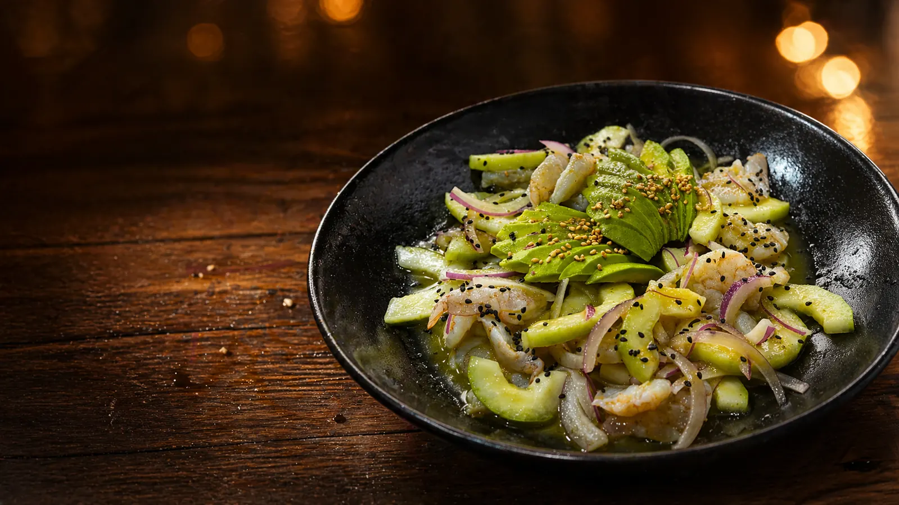
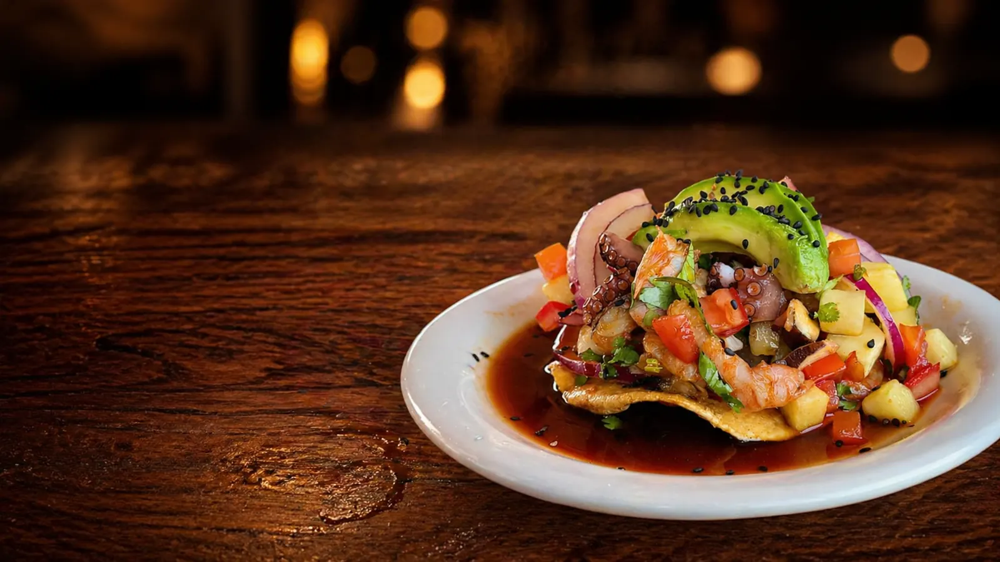
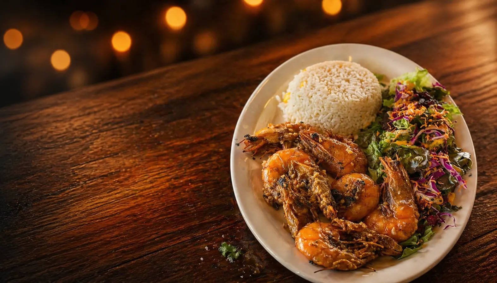
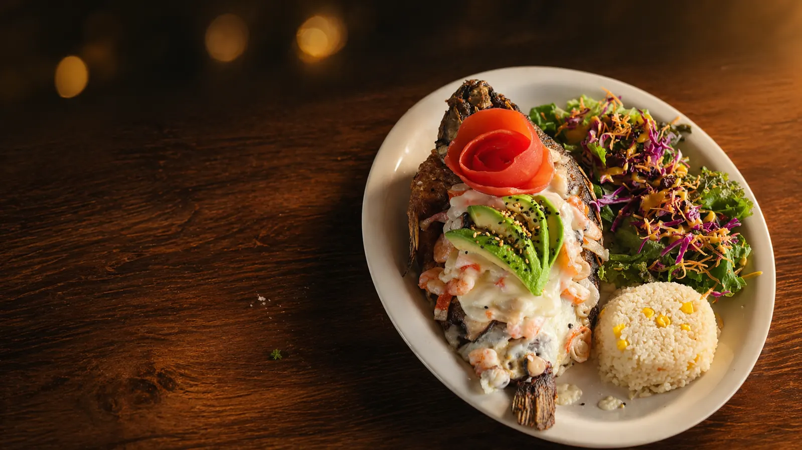
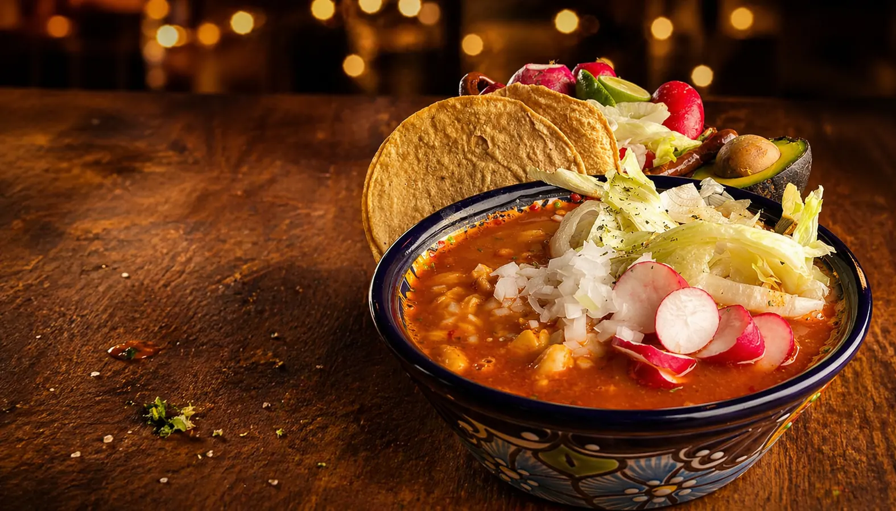
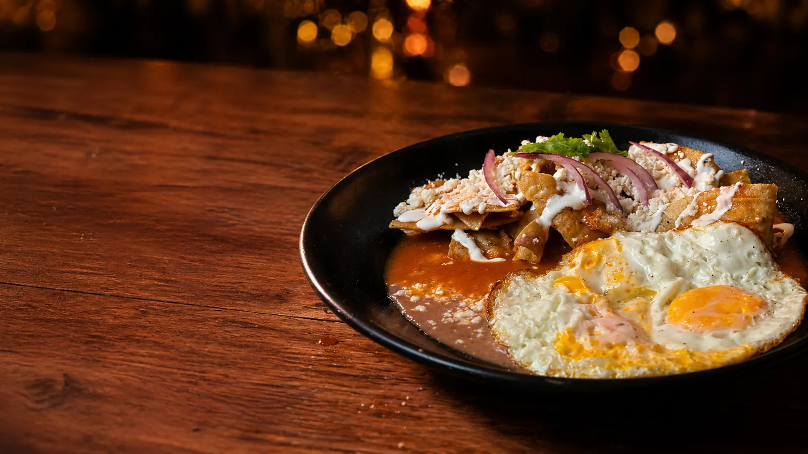

# Marisquería en Querétaro | Mariscos Muelle 27

> Mariscos frescos estilo costa de Michoacán, recetas de generación en generación. Aguachiles, ceviches, mariscadas, pozole y desayunos desde 9 AM · Reserva ya.

URL: https://mariscosmuelle27.com/

Saltar al contenido principal

Bitácora del Capitán · Entrada N.º 27

# Marisquería en Querétaro *Anclada en Jardines del Cimatario*

Mariscos frescos de la costa de Michoacán, con recetas heredadas de generación en generación. Aguachiles, ceviches, camarones, pescados, pozole los jueves-viernes y desayunos desde las 9 AM.

Reservar mesaVer la carta

⭐ Recetas familiares de MichoacánTerraza fresca zona surLun–Dom 9:00–18:30

Cuaderno de Bitácora

## El mar entero en seis capítulos

Aguachiles, ceviches, camarones, pescados, pozole los jueves-viernes y desayunos desde las 9 de la mañana. Todo con producto fresco y el sazón michoacano que nos distingue.

I

### Aguachiles

Verde, negro y de la casa. Camarón fresco marinado con limón, chile y el aire del Pacífico. Servidos fríos para compartir al centro de la mesa.
Ver capítulo de aguachiles →

II

### Ceviches y Tostadas

Pescado, camarón y mariscadas mixtas. Receta de la costa de Michoacán, heredada de generación en generación, en formato tostada o copa.
Ver ceviches y tostadas →

III

### Camarones

A la diabla, empanizados, al coco, zarandeados. El tripulante más querido del barco, con arroz y ensalada de guarnición.
Ver preparaciones de camarón →

IV

### Pescados y Mojarras

Filete empapelado, pescado zarandeado, mojarra frita entera. Pesca del día, sin conservadores, servida al momento.
Ver pescados del muelle →

V
Jueves · Viernes

### Pozole de la Casa

Dos días a la semana servimos pozole estilo de la casa, humeante, con todos los recaudos al centro de la mesa: cebolla, orégano, limón, rábano y tostadas.
Ver pozole de jueves y viernes →

VI
Desde 9 AM

### Desayunos

Arranca el día en el muelle. Chilaquiles, huevos al gusto y antojos con el toque marino de la casa, de lunes a domingo desde las 9 de la mañana.
Ver barra de desayunos →

Por qué el muelle

## Una marisquería en Querétaro con sazón de la costa de Michoacán

Mariscos Muelle 27 es una **marisquería en Querétaro** anclada en Jardines del Cimatario, al sur de la ciudad. Preparamos mariscos frescos con recetas de la **costa de Michoacán** heredadas de generación en generación: aguachiles, ceviches y tostadas, camarones, pescados y mojarras, pozole los jueves y viernes, y desayunos desde las 9 de la mañana.

Lo que nos distingue entre las marisquerías de Querétaro es la frescura del producto del Pacífico, los **precios visibles** en toda la carta y la terraza más fresca del sur de la ciudad. Estamos a minutos de Centro Sur, Colinas del Cimatario y Cerro del Cimatario — descubre por qué somos la marisquería del sur de Querétaro preferida de la zona.

- 🦐 Producto fresco de la costa de Michoacán
- 💲 Precios visibles en toda la carta
- 🌴 Terraza fresca en Jardines del Cimatario
- 🕘 Abierto los 7 días · 9:00–18:30 hrs

Diario de a bordo

## Lo que dicen quienes ya anclaron

Reseñas reales en tiempo real desde nuestra ficha de Google Maps. Cada comentario es de alguien que ya pasó por el muelle: léelos antes de venir y, cuando vuelvas a casa, déjanos la tuya.

Coordenadas del Puerto

## Dónde anclamos

## Jardín de Alcatraz, Jardines del Cimatario

Nuestro muelle se encuentra en el corazón de la zona sur de Querétaro, con **la terraza más fresca del sur de la ciudad**, ambiente familiar y la sazón del Pacífico esperándote de lunes a domingo, de 9:00 a 18:30 hrs.

**Mariscos Muelle 27** Jardín de Alcatraz s/n
Jardines del Cimatario, Querétaro
Tel: 442 808 5907
Lun–Dom · 9:00–18:30 hrs

Reservar ahoraCómo llegar

Provisiones para llevar

## Pídelo y pasa por él al muelle

¿Tienes prisa o quieres disfrutar tus mariscos frescos en casa? Llámanos o mándanos WhatsApp con tu pedido, te confirmamos cuándo está listo y solo pasas a recogerlo. Misma cocina, mismo sazón de la costa de Michoacán, en una bolsa con todo bien empacado para el camino.

1. 01

### Haz tu pedido

Escríbenos por WhatsApp al **442 808 5907** o llámanos directo. Tenemos toda la carta lista para llevar: aguachiles, ceviches, camarones, mojarras, pozole los jueves y viernes, y desayunos desde las 9 AM.

1. 02

### Te decimos cuándo

Te confirmamos el tiempo exacto según lo que pediste y cómo estamos en cocina. Así no esperas en la barra ni cargas con bolsa caliente más tiempo del necesario.

1. 03

### Pasa al muelle

Llegas, recoges tu pedido empacado en el muelle y listo. Pago en efectivo o tarjeta al recoger. Estacionamiento sobre Jardín de Alcatraz, justo enfrente.

Pedir por WhatsAppLlamar al 442 808 5907

Bitácora visual

## Un vistazo dentro del muelle

Tres páginas de nuestra bitácora: la terraza, la barra y los detalles que hacen que cada visita se sienta como llegar a casa después de un viaje largo.

Página 12 — Salón con cúpula

Anclaje 03 — La terraza

Margen 27 — Fachada al atardecer

Brújula

## Por qué Mariscos Muelle 27

### Mariscos frescos cada día

Pesca del día, sin conservadores. El producto llega con frecuencia para que la mesa tenga siempre lo mejor del Pacífico.

### La terraza más fresca del sur

Aire corrido, sombra natural y sin el calor del mediodía. Pensada para comer con calma en familia.

### Ambiente familiar

Menú para peques, mesas grandes, tiempos sin prisa. Se come, se conversa y se regresa.

Bitácora de Origen

## Nuestra Historia

Nuestro restaurante nace del amor por el mar y las recetas que han pasado de generación en generación en nuestra familia. El sazón que nos distingue tiene su origen en la cocina tradicional, donde los sabores frescos, el respeto por los ingredientes y el toque casero son la base de cada platillo.

La idea surgió del deseo de compartir con más personas esos momentos especiales alrededor de la mesa, donde los mariscos no sólo alimentan, sino que reúnen, celebran y crean recuerdos. Cada receta está inspirada en nuestras raíces, combinando tradición con un estilo único que hoy nos representa.

Más que un restaurante, somos un espacio donde el sabor, la calidad y la calidez se encuentran en cada detalle.

Conoce nuestra historia completa

Preguntas al Capitán

## Preguntas frecuentes

¿Dónde está Mariscos Muelle 27?

Estamos en Jardín de Alcatraz s/n, Jardines del Cimatario, en la zona sur de Querétaro. A pocos minutos del Cerro del Cimatario y del Centro Sur.
¿Qué días sirven pozole?

Servimos pozole estilo de la casa únicamente los jueves y viernes, durante el horario de comida hasta agotar existencia.
¿Tienen desayunos?

Sí, servimos desayunos desde las 9:00 de la mañana, de lunes a domingo: chilaquiles, huevos al gusto, antojos con el toque marino y más.
¿Qué estilo de mariscos preparan?

Mariscos frescos al estilo de la costa de Michoacán, con recetas que han pasado de generación en generación en nuestra familia. Aguachiles, ceviches, camarones, pescados zarandeados y mojarra frita.
¿Cuál es su horario?

Abrimos todos los días, de lunes a domingo, de 9:00 a 18:30 hrs.
¿Aceptan reservaciones?

Sí, puedes reservar llamando al 442 808 5907 o por WhatsApp.
¿Tienen comida para llevar?

Sí, toda la carta se prepara para llevar. Haz tu pedido por WhatsApp o llamando al 442 808 5907, te confirmamos en cuánto tiempo está listo y solo pasas a recogerlo a Jardín de Alcatraz s/n, Jardines del Cimatario.

Ven al muelle

## Reserva tu mesa hoy

La terraza más fresca del sur de Querétaro te espera. Reserva por WhatsApp o llama directo.

💬 Reservar por WhatsApp📞 Llamar al 442 808 5907
