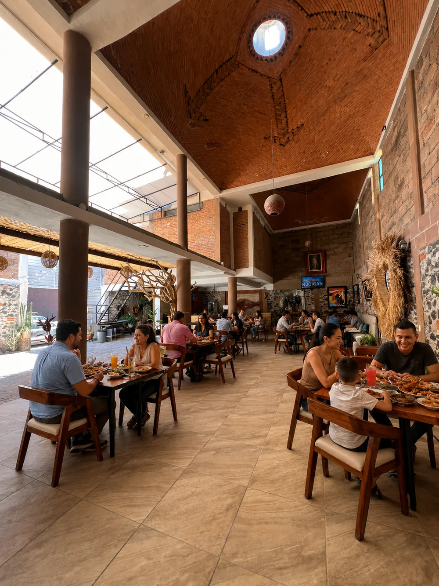
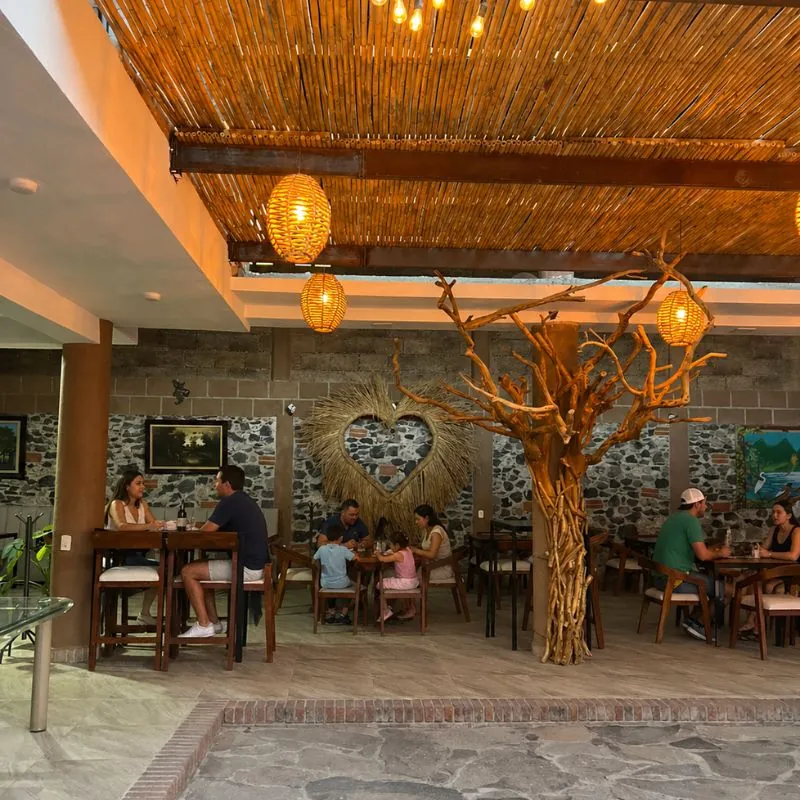
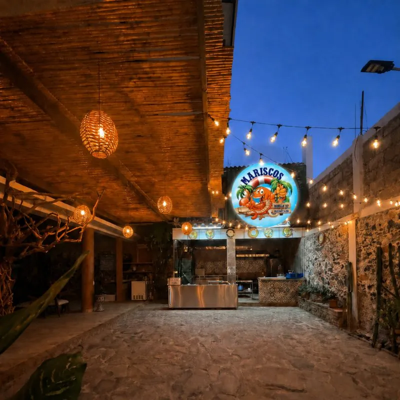

# Nosotros | Mariscos Muelle 27 — Historia Familiar

> La historia de Mariscos Muelle 27: recetas de la costa de Michoacán que pasaron de generación en generación, ahora en Jardines del Cimatario, Querétaro.

URL: https://mariscosmuelle27.com/nosotros/

Saltar al contenido principal

Bitácora de Origen

# Nuestra Historia

Mariscos Muelle 27 nace del amor por el mar y las recetas que han pasado de generación en generación en nuestra familia. Más que un restaurante, somos un espacio donde el sabor, la calidad y la calidez se encuentran en cada detalle.

Nuestra historia

## De la costa de Michoacán a Querétaro

Nuestro restaurante nace del amor por el mar y las recetas que han pasado de generación en generación en nuestra familia. El sazón que nos distingue tiene su origen en la cocina tradicional, donde los sabores frescos, el respeto por los ingredientes y el toque casero son la base de cada platillo.

La idea surgió del deseo de compartir con más personas esos momentos especiales alrededor de la mesa, donde los mariscos no sólo alimentan, sino que reúnen, celebran y crean recuerdos. Cada receta está inspirada en nuestras raíces, combinando tradición con un estilo único que hoy nos representa.

Más que un restaurante, somos un espacio donde el sabor, la calidad y la calidez se encuentran en cada detalle.

El nombre

## Qué significa "Muelle 27"

El número 27 es nuestro atraque: el muelle desde donde zarpamos cada mañana, metafóricamente hablando. Querétaro no tiene mar, pero lo traemos en cada platillo. El muelle es el punto de encuentro entre la costa y el desierto, entre la tradición familiar y quien cruza la puerta por primera vez.

Receta de origen

## Por qué "de la costa de Michoacán"

La costa michoacana tiene sazón propio: frescor cítrico, respeto por el pescado blanco, menos chile bravío que el norte, más equilibrio. Esa es la receta que nuestra familia trajo a Querétaro y que no cambiamos por nada.

No somos otra marisquería estilo Sinaloa — somos marisquería michoacana en pleno Bajío. Eso es lo que nos diferencia, y por eso cada plato tiene un balance distinto al que estás acostumbrado.

Lo que nos distingue

## Cinco cosas que nos hacen diferentes

👨‍👩‍👧

### Recetas familiares

No manuales de franquicia. Cada cocinero de la casa sigue las recetas de nuestra familia al pie de la letra.

🐟

### Producto fresco

Pesca con llegada frecuente, sin conservadores. Si el camarón no está en su punto, no sale de la cocina.

🌿

### Terraza fresca del sur

La terraza más fresca del sur de Querétaro, con sombra natural y aire corrido.

💵

### Precios visibles

Sin sorpresas. Todos los platillos llevan precio en la carta. Conocer el costo antes de pedir es respeto al cliente.

👪

### Ambiente familiar

No bar disfrazado de restaurante. Mesas grandes, menú infantil, tiempos sin prisa.

Bitácora visual

## Un vistazo dentro del muelle

Página 12 — Salón con cúpula

Anclaje 03 — La terraza

Margen 27 — Fachada al atardecer

Te esperamos en el muelle

## Ven a conocernos

Más que un restaurante, somos un espacio donde el sabor, la calidad y la calidez se encuentran en cada detalle. Te esperamos en nuestra marisquería en Querétaro; reserva por teléfono o WhatsApp.

💬 Reservar por WhatsApp📞 Llamar 442 808 5907
